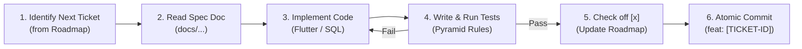

# Telly: Autonomous Engineering Rules of Engagement (AGENTS.md)

> **Mandatory operating instructions, coding protocols, and quality gates for AI agents (Antigravity) and developers implementing the Telly mobile application.**

---

## 🏛️ Prime Directive: Spec-Driven, Ticket-Anchored Development

Antigravity operates as a senior pair programmer and autonomous software engineer on this project. To ensure zero architectural drift, zero regression, and continuous verifiable progress, **all work must strictly adhere to the following six rules**:

### Rule 1: Strict Ticket Anchoring
- **Never write unassigned or untracked code.** Every single code change, refactor, or test must be anchored to an explicit **Ticket ID** defined in [`docs/PROJECT_ROADMAP_AND_SPRINT_PLAN.md`](file:///c:/Users/karla/Desktop/SeriesBeli/docs/PROJECT_ROADMAP_AND_SPRINT_PLAN.md) (e.g., `BE-101`, `FE-102`, `ALGO-201`, `QA-204`).
- If a user asks for a feature or modification not present in the roadmap, first locate the relevant sprint, formalize a ticket with spec references and acceptance criteria, add it to the roadmap, and then implement it.

### Rule 2: Mandatory Spec-Grounding Before Code
- Every ticket contains a `- **Spec Reference**:` pointing to one or more design, architecture, or feature documents in [`docs/`](file:///c:/Users/karla/Desktop/SeriesBeli/docs/).
- **The agent MUST view and read the cited spec document/section before authoring code or creating files.**
- Never guess color hex codes, layout dimensions, database column types, or mathematical formulas. Pull them directly from the cited spec document.

### Rule 3: The 70 / 20 / 10 Test Pyramid Discipline
- Follow [`docs/technical_architecture/06_TESTING_FRAMEWORK_AND_TEST_PYRAMID.md`](file:///c:/Users/karla/Desktop/SeriesBeli/docs/technical_architecture/06_TESTING_FRAMEWORK_AND_TEST_PYRAMID.md) rigorously:
  - **70% Base (Unit Tests)**: Pure Dart VM tests for algorithms (Binary Search Sort, Dynamic Percentile Score, Spearman Rank Correlation, TrueSkill), Drift SQLite DAOs, and data parsers (Letterboxd CSV, AniList GraphQL).
  - **20% Middle (Integration & Widget Tests)**: Flutter `WidgetTester` component tests for cards, swipe gestures, and modals; Riverpod `ProviderContainer` state tests; Supabase `pgTAP` stored procedure tests.
  - **10% Peak (E2E Tests)**: `package:integration_test` verifying the 4 Critical User Journeys (`CUJ-01` to `CUJ-04`).
- **No ticket is complete without its corresponding automated test.**

### Rule 4: Quality Gate Verification
- Before presenting a ticket as complete or creating a commit, run:
  ```bash
  dart analyze --fatal-infos
  flutter test
  ```
- **Zero compiler warnings, zero lint errors, and zero failing tests.**

### Rule 5: Progress Accounting in the Roadmap
- As each granular task in a ticket is completed, edit [`docs/PROJECT_ROADMAP_AND_SPRINT_PLAN.md`](file:///c:/Users/karla/Desktop/SeriesBeli/docs/PROJECT_ROADMAP_AND_SPRINT_PLAN.md):
  - Change `[ ]` to `[x]` for all finished tasks and test requirements.
  - Update the **Active Sprint Execution Dashboard** at the top of the file (update Completed count, Burn-Down %, and Current Active Ticket).

### Rule 6: Atomic Git Commits
- Commit every completed ticket as an isolated, atomic unit of work:
  ```bash
  git commit -m "feat(<scope>): [<TICKET-ID>] <concise description of deliverable>"
  ```
- Examples:
  - `feat(theme): [FE-102] implement Midnight Cathode color tokens and typography hierarchy`
  - `feat(ranking): [ALGO-201] implement binary insertion sort tournament with logarithmic bounds`
  - `test(ranking): [QA-201] add property-based unit tests for tournament invariants`

---

## 🎨 Design System & Architectural Constraints

When writing Flutter or Backend code, the agent must honor these non-negotiable invariants:

1. **Dual-Canon Segregation**:
   - The **Movie Canon** and **Series Canon** are strictly partitioned (`media_type: 'movie'` vs `'tv'`).
   - A film must NEVER duel against a TV show.
   - Dynamic percentile scores ($1.00 - 10.00$) are calculated independently for each canon.
2. **Visual Tokens (*Midnight Cathode*)** — canonical source: [`docs/design_system/01_DESIGN_PHILOSOPHY_AND_STYLE_GUIDE.md`](file:///c:/Users/karla/Desktop/SeriesBeli/docs/design_system/01_DESIGN_PHILOSOPHY_AND_STYLE_GUIDE.md) §2:
   - Void Canvas Background `#08090C`, Surface Raised `#11131A`, Surface Overlay `#1A1D27`, Stroke Subtle `#242938`.
   - Primary Accent: Phosphor Lime (`#D2FF52`).
   - Upset / Controversy Accent: Neon Coral (`#FF4B6E`).
   - Rating / Award Accent: Warm Amber (`#FFA733`).
   - Taste Match Accent: Electric Violet (`#7C5CFF`).
   - Glass Borders: `rgba(255, 255, 255, 0.08)` with subtle backdrop blur.
   - Score Tiers (style guide §2.2): God `9.20–10.00`, Prestige `8.50–9.19`, Great `7.80–8.49`, Good `7.00–7.79`, Mid `5.50–6.99`, Dropped `< 5.50`.
3. **State Management**:
   - Use **Riverpod 2.5+** exclusively (`@riverpod` code generation or `NotifierProvider`).
   - Avoid legacy `setState` or mixing multiple state management libraries.
4. **Local Persistence & Offline Sync**:
   - Use **Drift SQLite ORM** for local offline storage and reactive streams.
   - Offline mutations append to `OfflineDuelQueue` (Write-Ahead Log) for 0ms optimistic UI.

---

## 🔄 Standard 6-Step Ticket Execution Workflow



---
*Constitution Version: 1.0.0*  
*Enforced on: All Antigravity Agent Sessions*
