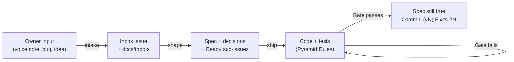

# Telly: Autonomous Engineering Rules of Engagement (AGENTS.md)

> **Mandatory operating instructions, coding protocols, and quality gates for AI agents (Antigravity) and developers implementing the Telly mobile application.**

---

## 🏛️ Prime Directive: Spec-Driven, Issue-Anchored Development

Antigravity operates as a senior pair programmer and autonomous software engineer on this project. To ensure zero architectural drift, zero regression, and continuous verifiable progress, **all work must strictly adhere to the following six rules**:

### Rule 1: Strict Issue Anchoring
- **Never write untracked code.** Every code change, refactor or test is anchored to a **GitHub issue** on `kandraos3/Telly`. The issue number (`#52`) is the ticket ID. The full system is in [`docs/process/WORKFLOW.md`](file:///c:/Users/karla/Desktop/SeriesBeli/docs/process/WORKFLOW.md).
- Status lives on the [**Telly** project board](https://github.com/users/kandraos3/projects/1) (Inbox → Shaping → Ready → In progress → Done), never in labels. Use `python tool/tracker/tracker.py` for board and issue operations.
- Use the skills: **`intake`** when the owner shares ideas, bugs or brain dumps; **`shape`** to turn an idea or epic into spec plus Ready sub-issues; **`ship`** to implement a Ready issue.
- If the owner asks for something with no issue, file one first (`intake`; for a small, obvious fix, file it straight to *In progress*), then build it.
- Sprint-era IDs (`FE-601`, `FE-AUTH-01`, …) are history, kept in [`docs/history/`](file:///c:/Users/karla/Desktop/SeriesBeli/docs/history/). Don't add to those files.

### Rule 2: Mandatory Spec-Grounding Before Code
- Every Ready issue cites one or more spec sections in [`docs/`](file:///c:/Users/karla/Desktop/SeriesBeli/docs/). If it doesn't, it isn't Ready: shape it first.
- **The agent MUST view and read the cited spec document/section before authoring code or creating files.**
- Never guess color hex codes, layout dimensions, database column types, or mathematical formulas. Pull them directly from the cited spec document.

### Rule 3: The 70 / 20 / 10 Test Pyramid Discipline
- Follow [`docs/technical_architecture/06_TESTING_FRAMEWORK_AND_TEST_PYRAMID.md`](file:///c:/Users/karla/Desktop/SeriesBeli/docs/technical_architecture/06_TESTING_FRAMEWORK_AND_TEST_PYRAMID.md) rigorously:
  - **70% Base (Unit Tests)**: Pure Dart VM tests for algorithms (Binary Search Sort, Dynamic Percentile Score, Spearman Rank Correlation, TrueSkill), Drift SQLite DAOs, and data parsers (Letterboxd CSV, AniList GraphQL).
  - **20% Middle (Integration & Widget Tests)**: Flutter `WidgetTester` component tests for cards, swipe gestures, and modals; Riverpod `ProviderContainer` state tests; Supabase `pgTAP` stored procedure tests.
  - **10% Peak (E2E Tests)**: `package:integration_test` verifying the 4 Critical User Journeys (`CUJ-01` to `CUJ-04`).
- **No ticket is complete without its corresponding automated test.**

### Rule 4: Quality Gate Verification
- Before presenting a ticket as complete or creating a commit, run:
  ```bash
  dart analyze --fatal-infos
  flutter test
  ```
- **Zero compiler warnings, zero lint errors, and zero failing tests.**

### Rule 5: Progress Accounting on the Board, Truth in the Spec
- Move the issue on the board as it progresses (`tracker.py track <N> --status ...`), and tick its acceptance criteria in the issue body or a closing comment.
- **A behaviour change updates its spec in the same commit.** Spec and code must never disagree. Record non-obvious product or architecture choices in [`docs/decisions/`](file:///c:/Users/karla/Desktop/SeriesBeli/docs/decisions/).
- Deferred or discovered work becomes a new issue, never a silent TODO.

### Rule 6: Atomic Git Commits
- Commit each completed issue as an isolated, atomic unit of work, referencing it:
  ```bash
  git commit -m "<type>(<scope>): <concise description> (#N)" -m "Fixes #N"
  ```
- `Fixes #N` only when the commit completes the issue; otherwise `Refs #N`. Reference the parent epic with `Refs #<epic>`.
- Examples:
  - `feat(explore): add "Because you ranked X" carousel rows (#52)`
  - `fix(theme): raise lime contrast on light-mode canon rows (#47)`
- Don't push unless the owner asks.

---

## 🎨 Design System & Architectural Constraints

When writing Flutter or Backend code, the agent must honor these non-negotiable invariants:

1. **Dual-Canon Segregation**:
   - The **Movie Canon** and **Series Canon** are strictly partitioned (`media_type: 'movie'` vs `'tv'`).
   - A film must NEVER duel against a TV show.
   - Dynamic percentile scores ($1.00 - 10.00$) are calculated independently for each canon.
2. **Visual Tokens (*Midnight Cathode*)** — canonical source: [`docs/design_system/01_DESIGN_PHILOSOPHY_AND_STYLE_GUIDE.md`](file:///c:/Users/karla/Desktop/SeriesBeli/docs/design_system/01_DESIGN_PHILOSOPHY_AND_STYLE_GUIDE.md) §2:
   - Void Canvas Background `#08090C`, Surface Raised `#11131A`, Surface Overlay `#1A1D27`, Stroke Subtle `#242938`.
   - Primary Accent: Phosphor Lime (`#D2FF52`).
   - Upset / Controversy Accent: Neon Coral (`#FF4B6E`).
   - Rating / Award Accent: Warm Amber (`#FFA733`).
   - Taste Match Accent: Electric Violet (`#7C5CFF`).
   - Glass Borders: `rgba(255, 255, 255, 0.08)` with subtle backdrop blur.
   - Score Tiers (style guide §2.2): God `9.20–10.00`, Prestige `8.50–9.19`, Great `7.80–8.49`, Good `7.00–7.79`, Mid `5.50–6.99`, Dropped `< 5.50`.
3. **State Management**:
   - Use **Riverpod 2.5+** exclusively (`Notifier` / `AsyncNotifier` via `NotifierProvider` / `AsyncNotifierProvider`).
   - Zero legacy `StateNotifier`, `StateNotifierProvider`, `StateProvider`, or `ChangeNotifier` in `lib/`.
   - `setState` is strictly allowed ONLY for ephemeral UI-internal state (e.g. animation controllers, button press scaling, focus, drag offsets, modal form draft chips, expandable accordions); never for business, ranking, auth, or domain state.
4. **Local Persistence & Offline Sync**:
   - Use **Drift SQLite ORM** for local offline storage and reactive streams.
   - Offline mutations append to `OfflineDuelQueue` (Write-Ahead Log) for 0ms optimistic UI.

---

## 🛰️ Backend Deployment (Supabase)

All remote Supabase work (checking what's live, applying migrations, deploying edge functions, setting or checking secrets, running pgTAP) **must go through the `supabase-deploy` skill**: [`.agents/skills/supabase-deploy/SKILL.md`](file:///c:/Users/karla/Desktop/SeriesBeli/.agents/skills/supabase-deploy/SKILL.md) (mirrored in `.claude/skills/`).
- Start with its read-only `status` action, and author migrations and edge functions following its §4–§5 conventions.
- The only manual step for the human is `supabase login`. Never ask for database passwords or tokens.
- Confirm with the user before writing to `telly-prod` (push / functions / deploy) unless they asked for a deploy in the current session. Deploy the backend before releasing an app build that depends on it.

---

## 🔄 Standard Workflow



---
*Constitution Version: 2.0.0 (2026-10-06: issues replace the sprint roadmap; see decision 0001)*  
*Enforced on: All Antigravity Agent Sessions*
