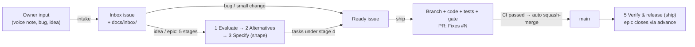

# Telly: Autonomous Engineering Rules of Engagement (AGENTS.md)

> **Mandatory operating instructions, coding protocols, and quality gates for every AI agent (Claude Code, Antigravity, Gemini, …) and developer working on the Telly mobile application.**
>
> This file is the single source. `CLAUDE.md` and `GEMINI.md` are generated copies, and `.claude/skills/` mirrors `.agents/skills/`. Edit only `AGENTS.md` / `.agents/skills/`, then run `python tool/agents/sync.py`. CI fails on drift.

---

## 🧭 Operating Model: the Owner Is the PM, Agents Do the Work

The owner acts as product manager. **Agents do all implementation and all tracking**: filing, triaging, moving cards, advancing stages, closing issues, keeping specs and the roadmap current. The owner only:
- shares ideas, bugs and voice notes;
- answers issues labelled **`needs-owner`** (post the question as a comment with options and a recommendation, then add the label);
- does issues labelled **`human-only`** (consoles, secrets, stores, physical devices; write exact steps).

Never ask the owner to move a card, add a label, close an issue or write a ticket.

### Skill routing (mandatory)

Before acting, match the request to a skill and load it. If several match, use them in this order.

| Situation | Skill |
|---|---|
| Owner shares an idea, complaint, bug, voice note or screenshot, however casual; or asks to triage the Inbox | **`intake`** |
| Owner asks "what's the status / what's next / what needs me?" | Run `python tool/tracker/tracker.py sync` then `report`, and summarise (no skill needed) |
| Working an Evaluate, Explore alternatives or Specify stage; designing, spec'ing or breaking down a feature; an issue lacks acceptance criteria | **`shape`** |
| Implementing a task, bug or chore; "work on #N"; "pick up the next thing"; a Verify & release stage | **`ship`** |
| Any Supabase migration, edge function, secret, pgTAP or "what's live" | **`supabase-deploy`** |
| Running the app on a phone or emulator | **`mobile-deploy`** |

All issue and board operations go through `python tool/tracker/tracker.py` (see [`docs/process/WORKFLOW.md`](file:///c:/Users/karla/Desktop/SeriesBeli/docs/process/WORKFLOW.md) §7). Don't hand-edit project fields with raw `gh project` calls.

---

## 🏛️ Prime Directive: Spec-Driven, Issue-Anchored Development

Every agent operates as a senior pair programmer and autonomous software engineer on this project. To ensure zero architectural drift, zero regression, and continuous verifiable progress, **all work must strictly adhere to the following six rules**:

### Rule 1: Strict Issue Anchoring
- **Never write untracked code.** Every code change, refactor or test is anchored to a **GitHub issue** on `kandraos3/Telly`. The issue number (`#52`) is the ticket ID. The full system is in [`docs/process/WORKFLOW.md`](file:///c:/Users/karla/Desktop/SeriesBeli/docs/process/WORKFLOW.md).
- Status lives on the [**Telly** project board](https://github.com/users/kandraos3/projects/1) (Inbox → Backlog → Shaping → Ready → In progress → Done), never in labels.
- **Ideas and epics follow five standard stages** (Evaluate → Explore alternatives → Specify → Implement → Verify & release), created automatically as sub-issues from `tool/tracker/stages.json`. The concrete work is task sub-issues under the Implement stage. Finish stages only with `tracker.py advance`.
- If the owner asks for something with no issue, file one first (`intake`; for a small, obvious fix, file it straight to *In progress*), then build it.
- Sprint-era IDs (`FE-601`, `FE-AUTH-01`, …) are history, kept in [`docs/history/`](file:///c:/Users/karla/Desktop/SeriesBeli/docs/history/). Don't add to those files.

### Rule 2: Mandatory Spec-Grounding Before Code
- Every Ready issue cites one or more spec sections in [`docs/`](file:///c:/Users/karla/Desktop/SeriesBeli/docs/). If it doesn't, it isn't Ready: shape it first.
- **The agent MUST view and read the cited spec document/section before authoring code or creating files.**
- Never guess color hex codes, layout dimensions, database column types, or mathematical formulas. Pull them directly from the cited spec document.

### Rule 3: The 70 / 20 / 10 Test Pyramid Discipline
- Follow [`docs/technical_architecture/06_TESTING_FRAMEWORK_AND_TEST_PYRAMID.md`](file:///c:/Users/karla/Desktop/SeriesBeli/docs/technical_architecture/06_TESTING_FRAMEWORK_AND_TEST_PYRAMID.md) rigorously:
  - **70% Base (Unit Tests)**: Pure Dart VM tests for algorithms (Binary Search Sort, Dynamic Percentile Score, Spearman Rank Correlation, TrueSkill), Drift SQLite DAOs, and data parsers (Letterboxd CSV, AniList GraphQL).
  - **20% Middle (Integration & Widget Tests)**: Flutter `WidgetTester` component tests for cards, swipe gestures, and modals; Riverpod `ProviderContainer` state tests; Supabase `pgTAP` stored procedure tests.
  - **10% Peak (E2E Tests)**: `package:integration_test` verifying the 5 Critical User Journeys (`CUJ-01` to `CUJ-05`).
- **No ticket is complete without its corresponding automated test.**

### Rule 4: Quality Gate Verification
- Before every commit, and before opening or updating a pull request, run:
  ```bash
  dart analyze --fatal-infos
  flutter test
  ```
- **Zero compiler warnings, zero lint errors, and zero failing tests.**
- CI runs the same gate plus coverage, pgTAP, Deno and the emulator CUJs on every pull request. Its `CI passed` check is required, so a red PR can't merge.

### Rule 5: Progress Accounting on the Board, Truth in the Spec
- Move the issue on the board as it progresses (`tracker.py track`, `advance`, `close`), tick its acceptance criteria in the issue body or a closing comment, and run `tracker.py sync` after a pull request merges.
- **A behaviour change updates its spec in the same commit.** Spec and code must never disagree. Record non-obvious product or architecture choices in [`docs/decisions/`](file:///c:/Users/karla/Desktop/SeriesBeli/docs/decisions/).
- Deferred or discovered work becomes a new issue, never a silent TODO.

### Rule 6: One Branch and One Pull Request per Issue (or Epic)
- **`main` is protected.** Nothing is pushed to it directly. A pull request merges only when the `CI passed` and `PR title` checks pass. Full rules: [`docs/process/WORKFLOW.md`](file:///c:/Users/karla/Desktop/SeriesBeli/docs/process/WORKFLOW.md) §6.
- **For standalone issues (bugs, chores, single tasks):** Start each issue on a fresh branch from an up-to-date `main`, named `<type>/<N>-<slug>`:
  ```bash
  git switch main && git pull --ff-only && git switch -c fix/152-edge-jwt
  ```
  Open one pull request for this issue.
- **For epics (Integration Branches):** Start a single integration branch for the entire epic from an up-to-date `main`, named `epic/<N>-<slug>` (where N is the epic's Implement stage issue number). For every task issue inside that epic, commit directly to this epic branch using the task issue number in the commit message. Once all tasks are complete, open **one pull request for the entire epic**.
- Commit on the branch as often as useful (`<type>(<scope>): <description>`). PRs are squash-merged, so the **PR title** becomes the one atomic commit on `main`: `<type>(<scope>): <concise description>`, with no `(#N)` (GitHub appends the PR number). Examples:
  - `feat(explore): add "Because you ranked X" carousel rows`
  - `fix(theme): raise lime contrast on light-mode canon rows`
- Open the PR with `python tool/tracker/tracker.py pr <N> --title "…" [--refs <epic>] --body-file <summary>`. It pushes the branch, writes `Fixes #N` (or `Refs #N` for stages and `--no-close`) into the body and turns on **auto-merge**: the PR squash-merges itself once CI is green. Pushing branches and opening PRs needs no further go-ahead from the owner.
- Red CI: fix it on the same branch. A job that fails and then passes on a re-run with no change is flaky: file a `bug` for it.
- Never push to `main`, force-push a shared branch, or ask for the ruleset to be lifted to get a change in.

---

## 🎨 Design System & Architectural Constraints

When writing Flutter or Backend code, the agent must honor these non-negotiable invariants:

1. **Dual-Canon Segregation**:
   - The **Movie Canon** and **Series Canon** are strictly partitioned (`media_type: 'movie'` vs `'tv'`).
   - A film must NEVER duel against a TV show.
   - Dynamic percentile scores ($1.00 - 10.00$) are calculated independently for each canon.
2. **Visual Tokens (*Midnight Cathode*)** — canonical source: [`docs/design_system/01_DESIGN_PHILOSOPHY_AND_STYLE_GUIDE.md`](file:///c:/Users/karla/Desktop/SeriesBeli/docs/design_system/01_DESIGN_PHILOSOPHY_AND_STYLE_GUIDE.md) §2:
   - Void Canvas Background `#08090C`, Surface Raised `#11131A`, Surface Overlay `#1A1D27`, Stroke Subtle `#242938`.
   - Primary Accent: Phosphor Lime (`#D2FF52`).
   - Upset / Controversy Accent: Neon Coral (`#FF4B6E`).
   - Rating / Award Accent: Warm Amber (`#FFA733`).
   - Taste Match Accent: Electric Violet (`#7C5CFF`).
   - Glass Borders: `rgba(255, 255, 255, 0.08)` with subtle backdrop blur.
   - Score Tiers (style guide §2.2): God `9.20–10.00`, Prestige `8.50–9.19`, Great `7.80–8.49`, Good `7.00–7.79`, Mid `5.50–6.99`, Dropped `< 5.50`.
3. **State Management**:
   - Use **Riverpod 2.5+** exclusively (`Notifier` / `AsyncNotifier` via `NotifierProvider` / `AsyncNotifierProvider`).
   - Zero legacy `StateNotifier`, `StateNotifierProvider`, `StateProvider`, or `ChangeNotifier` in `lib/`.
   - `setState` is strictly allowed ONLY for ephemeral UI-internal state (e.g. animation controllers, button press scaling, focus, drag offsets, modal form draft chips, expandable accordions); never for business, ranking, auth, or domain state.
4. **Local Persistence & Offline Sync**:
   - Use **Drift SQLite ORM** for local offline storage and reactive streams.
   - Offline mutations append to `OfflineDuelQueue` (Write-Ahead Log) for 0ms optimistic UI.

---

## 🛰️ Backend Deployment (Supabase)

All remote Supabase work (checking what's live, applying migrations, deploying edge functions, setting or checking secrets, running pgTAP) **must go through the `supabase-deploy` skill**: [`.agents/skills/supabase-deploy/SKILL.md`](file:///c:/Users/karla/Desktop/SeriesBeli/.agents/skills/supabase-deploy/SKILL.md) (mirrored in `.claude/skills/`).
- Start with its read-only `status` action, and author migrations and edge functions following its §4–§5 conventions.
- The only manual step for the human is `supabase login`. Never ask for database passwords or tokens.
- Confirm with the user before writing to `telly-prod` (push / functions / deploy) unless they asked for a deploy in the current session. Deploy the backend before releasing an app build that depends on it.
- **Deploy only merged code**: from `main`, level with `origin/main`, after the PR merges. The deploy script and the challenge publisher refuse anywhere else.

---

## 🔄 Standard Workflow



---
*Constitution Version: 2.1.0 (2026-10-07: branches and pull requests into a protected `main`; see decision 0006)*  
*Enforced on: All Antigravity Agent Sessions*
