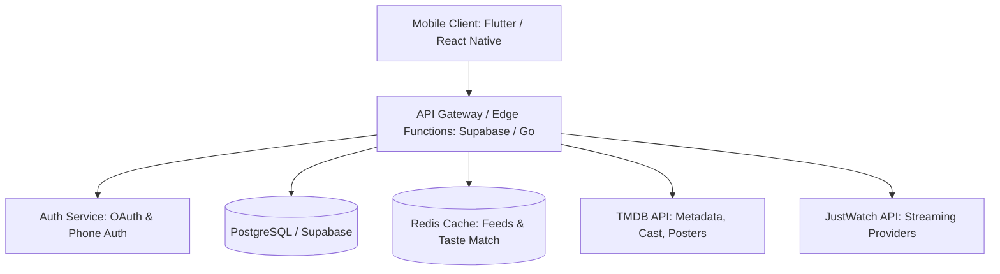

# 📺 Telly — Product Design Document & System Architecture
> *The Beli for Screen Entertainment: Pairwise Ranking, Social Taste Matching, and Dual-Canon Discovery for Movies, TV Shows, Series & Anime.*

---

## 1. Executive Summary & Vision

### 1.1 The Opportunity
Modern screen entertainment is experiencing a golden age of volume, but a crisis of discovery and rating fatigue. Viewers subscribe to 4–6 streaming services (Netflix, Max, Crunchyroll, Apple TV+, Criterion) and spend an average of 18 minutes per session just scrolling menus. Existing review and tracking platforms suffer from severe structural flaws:
- **IMDb / Rotten Tomatoes**: Susceptible to review bombing, extreme rating inflation (90% of watchable content clusters between 7.4 and 8.3), and impersonal aggregate scores that ignore individual taste.
- **Letterboxd**: Exceptional for feature films, but multi-season episodic television tracking is clunky, fragmented, and treated as an afterthought; rating stars are static and prone to 5-star or 1/2-star clustering.
- **MyAnimeList / AniList**: Invaluable for otaku cataloging, but utilitarian, spreadsheet-like, and lacking viral pairwise ranking or unified cross-medium taste-matching with mainstream movies and prestige TV.
- **TV Time / Trakt**: Focus heavily on utility and calendar episode-checking ("did you watch episode 4?"), with minimal social virality, aesthetic delight, or comparative ranking.

### 1.2 The Beli Analogy & The Dual-Canon Architecture
**Beli** revolutionized restaurant discovery by eliminating arbitrary star ratings. Instead of asking *"Is this burger a 4 or 5 stars?"*, Beli uses **head-to-head pairwise comparisons** (*"Did you like this restaurant better than Carbone or Joe's Pizza?"*). This creates a strictly ordered, personal leaderboard that eliminates scale drift and calculates dynamic decimal scores (e.g., 9.2 vs 8.6). Paired with a vibrant social graph and Taste Match %, Beli turned food tracking into an addictive lifestyle habit.

**Telly** brings this exact paradigm to all screen entertainment through a **Dual-Canon Architecture**:
1. **The Movie Canon**: A pristine, strictly ordered ranking of all feature films, anime films, and documentaries.
2. **The Series & Anime Canon**: A dedicated leaderboard for serialized television, limited series, and anime seasons.
3. **Segregated Pairwise Duels**: Movies battle movies; series battle series. This eliminates the cognitive friction of comparing an 80-hour epic (*The Sopranos*) against a 2-hour cinematic masterpiece (*The Godfather*), while allowing users to seed their profile with 1-click **Letterboxd (`diary.csv`)** and **AniList/MAL** sync.
4. **Unified Social Graph & Taste Match**: Friends compare taste across movies, series, or unified blended taste scores, with real-time "Movie Night vs. TV Binge" resolution.

---

## 2. Naming & Brand Identity

### 2.1 Name Ideation Matrix

| Name | Vibe | Pros | Cons | Verdict |
| :--- | :--- | :--- | :--- | :--- |
| **Telly** | Warm, nostalgic, sleek | Two syllables, ends in 'y' like Beli; ubiquitous slang for TV; friendly and approachable; sounds great as a verb ("Log it on Telly"). | Common dictionary word, though standard for modern tech brands. | **⭐ TOP PICK (Hero Brand)** |
| **Bingi** | Playful, cheeky, energetic | Direct nod to binge-watching; cute 2-syllable rhythm; great mascot potential. | Slightly informal; may encourage unhealthy binge connotations. | Strong Alternative |
| **Pilot** | Editorial, cinematic, sharp | Refers to episode 1; minimalist; appeals to prestige drama lovers. | A bit serious; doesn't sound as social or casual as Beli. | Runner Up |
| **Couchy** | Cozy, communal, relaxed | Evokes relaxation and weekend watching; highly social. | A bit too informal; lacks prestige feel. | Viable Alternative |
| **Queue** | Utilitarian, functional | Clean; instantly understood concept. | Hard to trademark; sounds cold and administrative. | Pass |

### 2.2 Brand Persona: Telly
- **Tagline**: *"Your personal TV canon. Ranked, shared, settled."*
- **Tone**: Editorial yet casual, witty, visually vibrant, cinephile-friendly without being snobbish.
- **Color Palette**:
  - *Midnight Cathode* (`#0A0B10`): Deep OLED dark background mimicking a cinematic home theater.
  - *Phosphor Lime* (`#D2FF52`): High-energy neon accent for primary actions, rankings, and win states.
  - *Warm Amber* (`#FFA733`): Secondary warm accent for nostalgia, favorites, and high tier badges.
  - *Ghost Lavender* (`#9D9AB4`): Neutral slate for metadata, tags, and secondary navigation.

---

## 3. Core Mechanics & The Ranking Engine

Traditional 1–10 star scales fail because human evaluation shifts with mood, recency, and nostalgia. An 8/10 given in 2021 might be worse than a 7.5/10 given yesterday. Telly replaces absolute ratings with **Relative Pairwise Comparison**.

```
[ New Show Logged: "Severance" ]
               │
               ▼
   Round 1: Severance  VS  Succession
            (User chooses: Severance)
               │
               ▼
   Round 2: Severance  VS  Breaking Bad
            (User chooses: Breaking Bad)
               │
               ▼
   Round 3: Severance  VS  The Bear
            (User chooses: Severance)
               │
               ▼
 [ Exact Personal Rank Calculated: #4 of 87 ]
 [ Dynamic Score Generated: 9.38 / 10.0 ]
```

### 3.1 Pairwise Binary Search Insertion
When a user finishes or rates a show:
1. **Initial Seed Placement**: The user quickly selects an initial broad sentiment bucket:
   - *Masterpiece (Top 10%)*
   - *Loved It (Top 25%)*
   - *Liked It (Middle 40%)*
   - *Mediocre (Bottom 20%)*
   - *Disappointed / Dropped (Bottom 5%)*
2. **Binary Search Tournament**:
   - The engine targets the midpoint of that selected bracket and presents a binary choice:
     *“Which did you like more overall: **Severance** or **The Bear**?”*
   - With $N$ total ranked shows in that bucket, it requires only $\log_2(N)$ comparisons (usually **3 to 5 quick taps**) to find the precise ranking slot.
3. **No Deadlocks**: If the user genuinely can't decide, a *"Can't Compare / Too Different"* button triggers an adjacent neighbor comparison without corrupting the sorting tree.

### 3.2 Dynamic Score Mapping
Rather than storing fixed user-entered numbers, Telly derives a dynamic 0.0–10.0 score based on **percentile distribution**:
$$\text{Score}(r) = 10.0 - 9.0 \times \left(\frac{r - 1}{N - 1}\right)^\gamma$$
*(where $r$ is the item's rank from 1 to $N$, and $\gamma$ is a curvature constant, typically $\approx 0.85$, creating a natural prestige curve where elite shows hold 9.0+ while mid-tier titles spread between 6.0 and 8.0).*
- **Why this works**: As the user adds more shows over months and years, their personal leaderboard remains internally consistent, rational, and immune to score inflation.

### 3.3 The "Series vs. Season" Dilemma (The Downfall & Anthology Problem)
TV differs fundamentally from restaurants because a show can start as a masterpiece and finish terribly (*Game of Thrones*), or tell completely standalone stories every season (*True Detective*, *Fargo*, *White Lotus*).

**Telly's Two-Layer Architecture**:
1. **Primary Layer (Series Level)**:
   - What lives on the main profile leaderboard. Evaluates the show holistically.
2. **Sub-Layer (Season Breakdowns & Weights)**:
   - Users can optionally toggle *"Rank Seasons"* for any show.
   - Users can assign an **"Ending Impact"** modifier (e.g., *"Great journey, ruined ending"* vs. *"Flawless finale"*).
   - Season-level leaderboards exist as dedicated sub-tabs for power users.
3. **"Dropped / DNF" State**:
   - Users can log shows they abandoned without polluting their completed rankings.
   - Captures milestone: *"Dropped at Season 3, Episode 4"*, with optional reasons (*Pacing slowed down*, *Lost interest*, *Cast departure*).

### 3.4 The Dual-Canon Segregation (The Apples-to-Oranges Problem)
Comparing a 2-hour self-contained film (*The Godfather* or *Spirited Away*) directly against an 80-hour multi-year commitment (*The Sopranos* or *Attack on Titan*) induces severe cognitive dissonance. Their emotional pacing, character depth, and narrative structure operate under completely different artistic economics.

**Telly's Dual-Canon Solution**:
- **Segregated Duels by Default**:
  - **Movies Duel Movies**: When logging a film, comparisons are strictly drawn against other ranked movies in the user's **Movie Canon**.
  - **Series Duel Series**: When logging a TV show or anime season, comparisons are strictly drawn against other ranked series in the **Series & Anime Canon**.
- **Unified Profile, Segregated Leaderboards**: The profile features a seamless two-segmented controller: `[ 🎬 Movies ] [ 📺 Series & Anime ] [ ⚡ Blended (Optional) ]`.
- **Movie-Specific Logging Nuances**: Movies record director, runtime (minutes), theatrical vs. home viewing venue, and rewatch count.

---

## 4. Feature Specifications

```
                     ┌──────────────────────────┐
                     │       TELLY APP          │
                     └─────────────┬────────────┘
         ┌─────────────────┬───────┴─────────┬──────────────────┐
         ▼                 ▼                 ▼                  ▼
   1. The Canon     2. Social Graph    3. Discovery &     4. Smart Queue
   (Ranking Engine)  (Taste Matching)   Co-Watching        & Streaming
   • Pairwise Duels • Friend Feed      • 2-to-Watch Duel  • Universal Queue
   • Tier Lists     • Taste Match %    • Streaming Filter • Release Alerts
   • Season Toggles • Squad Boards     • AI Vibe Match    • DNF Tracker
```

### 4.1 Log & Duel Flow (The Core Loop)
- **Instant Search**: Powered by TMDB `/search/multi` + JustWatch API. Shows poster art, media type pill (`[🎬 Movie]` / `[📺 Series]` / `[⚡ Anime]`), network/studio logo (HBO, Apple TV+, A24, Ghibli), year, runtime, and streaming availability.
- **Log Options**:
  - *Movies*: Watched Film, Rewatched Film (increments rewatch counter).
  - *Series & Anime*: Finished Whole Series, Up to Date (Ongoing), Watched a Season, Dropped / Paused.
- **Tagging & Editorial Metadata**:
  - *Viewing Venue (Movies)*: Theatrical / IMAX, Home Streaming, Film Festival, In-Flight.
  - *Director & Creator Recognition*: Dedicated director tagging for movies (e.g., Christopher Nolan, Denis Villeneuve, Hayao Miyazaki).
  - *Who did you watch with?* (Tag friends on Telly).
  - *Binge Velocity / Format*: Binge in a weekend vs. Weekly airing vs. Single sitting.
  - *Editorial Tags*: e.g., *"Mind-Bending"*, *"Cinematography Peak"*, *"Comfort Watch"*, *"Great Soundtrack"*, *"Emotional Wreck"*.
  - *MVP Character / Actor*: Highlight the standout performance.
  - *Short Review / Hot Take*: 280-character micro-review.
- **Pairwise Duel**: Clean full-screen card swipe or tap interface strictly segregated by canon:
  - *Movie vs Movie*: Compares against movies in the user's Movie Canon.
  - *Series vs Series*: Compares against shows in the user's Series Canon.

### 4.2 The Social Graph & Taste Match %
- **Taste Match % Algorithm**:
  - Computes the **Spearman Rank Correlation Coefficient** ($\rho$) across co-ranked items between User $A$ and User $B$:
    $$\rho = 1 - \frac{6 \sum d_i^2}{k(k^2 - 1)}$$
    *(where $d_i$ is the difference in rank for item $i$, and $k$ is the number of mutually ranked items).*
  - Calculates segregated match scores: **Movie Taste Match %** and **Series Taste Match %**, plus a weighted blended overall score.
- **Friend Feed**:
  - Clean chronological or algorithmic feed of friends' movie and series logs.
  - Highlights *Upsets* and *Controversial Takes*: e.g., *"Alex ranked Dune: Part Two over Interstellar (Movie Upset 🔥)"* or *"Maya ranked The Bear over Succession"*.
  - Quick-save button: 1-tap add to your personal Movie or Series Watchlist directly from any friend's log.
- **Squad Leaderboards**:
  - Create private circles (e.g., *"Movie Night Crew"*, *"Anime Club"*, *"Prestige TV Addicts"*).
  - Merged group leaderboards showing squad consensus for both movies and shows.

### 4.3 "Two-to-Watch" (The Couples & Friends Decider)
One of the highest-friction moments in entertainment is two people sitting on a couch asking: *"What should we watch?"*
- **How it works**:
  1. Select 1 to 4 friends you are watching with.
  2. **Select Format**: Toggle between **"Movie Night"** (single sitting) or **"Start a Series"** (multi-episode commitment).
  3. **Runtime Filters (For Movies)**: Quick pills for *"< 90 min (Breezy)"*, *"90–120 min (Sweet Spot)"*, *"120+ min (Epic)"*.
  4. Select common streaming subscriptions (e.g., Netflix + Max + Criterion).
  5. **The Output**: A ranked joint recommendation list computed by:
     - Titles on both users' Watchlists.
     - Titles user A loved ($>8.5$) that user B hasn't seen yet (and vice versa).
     - Weighted by Taste Match compatibility.
  6. **Quick-Draw Vibe Check (Optional)**: A rapid 15-second simultaneous card swipe on 5 candidates; first mutual right-swipe wins the night.

### 4.4 Profile & "The Canon"
- **Dual-Canon Leaderboard**:
  - Top tab switcher: `[ 🎬 Movie Canon ] [ 📺 Series & Anime ] [ ⚡ Blended ]`.
  - Top 10 Showcase Banner: Customizable poster art showcasing user's all-time Top 10 films or series.
- **Tier Categorization**:
  - **God Tier / S-Tier** (9.2 – 10.0)
  - **Prestige Tier** (8.5 – 9.1)
  - **Great Tier** (7.8 – 8.4)
  - **Good / Fun** (7.0 – 7.7)
  - **Mid / Background Noise** (5.5 – 6.9)
  - **DNF / Disappointment** (< 5.5)
- **Deep Filter Tools**: Filter personal or friends' rankings by:
  - Streaming service (Max, Criterion, Netflix, Apple TV+, etc.)
  - Director / Creator (Nolan, Bong Joon-ho, Miyazaki, Armstrong, Gilligan)
  - Genre & Decade (70s, 80s, 90s, 2000s, 2010s, 2020s)
  - Runtime buckets (< 100m, 100-140m, 140m+)
  - Viewing venue (Theatrical vs Home)

### 4.5 Telly Wrapped & Viral Sharing
- **Monthly / Annual Recaps**:
  - Total movies logged vs. TV seasons finished; total minutes watched.
  - Top Director and Top Network breakdowns (e.g., *"Your top director: Christopher Nolan (4 films, avg 9.6)"*).
  - Theatrical vs. Home ratio (e.g., *"42% of your movies were experienced in theaters"*).
  - Most controversial take (title where your rank differed most from the global average).
- **Exportable Social Graphics**:
  - Perfectly sized Instagram Story cards displaying:
    * *My All-Time Top 9 Movie Grid* or *Top 9 TV Grid*
    * *2026 Screen Entertainment Tier List*
    * *Letterboxd Migration Card ("Imported 412 films to Telly — here is my true #1")*
    * *Head-to-Head Taste Match Card with @Friend*

---

## 5. Information Architecture & Navigation

The mobile application utilizes a 5-tab persistent bottom navigation bar:

```
┌────────────────────────────────────────────────────────┐
│                      TOP BAR                           │
│  [ Filter: All / TV Drama / Mini ]      [ 🔍 Search ]  │
├────────────────────────────────────────────────────────┤
│                                                        │
│  TAB 1: FEED       Activity of friends, upsets, & logs │
│  TAB 2: DISCOVER   Trending, network rankings, curation│
│  TAB 3: [ + ] LOG  Quick duel & logging modal          │
│  TAB 4: QUEUE      Watchlist, Up-to-Date, DNF list     │
│  TAB 5: PROFILE    The Canon, Tier lists, Stats, Match │
│                                                        │
├────────────────────────────────────────────────────────┤
│  [ 🏠 Feed ] [ 🧭 Explore ] [ ➕ ] [ 📑 Queue ] [ 👤 Profile ]│
└────────────────────────────────────────────────────────┘
```

---

## 6. Technical Architecture & Tech Stack



### 6.1 Recommended Stack
- **Frontend**: **Flutter** (Dart) or **React Native** (Expo) for 60fps fluid swipe gestures, haptic feedback, and cross-platform iOS & Android parity.
- **Backend / Database**: **Supabase** (Managed PostgreSQL) with Edge Functions or Go microservices.
  - PostgreSQL handles relational ranking tables, adjacency trees, and spatial/graph queries with ease.
- **Caching & Ranking Cache**: **Redis** for fast session-based duel states, feed generation, and caching heavy Taste Match correlation matrices.
- **Third-Party Data Providers**:
  - **TMDB (The Movie Database) API**: Source of truth for TV shows, episode lists, air dates, creator info, and high-res imagery.
  - **JustWatch API**: Geolocation-aware streaming availability (Netflix, Max, Disney+, Prime, Apple TV+, etc.).

### 6.2 Relational Data Model (PostgreSQL Schema)

```sql
-- Users Table
CREATE TABLE users (
    id UUID PRIMARY KEY DEFAULT gen_random_uuid(),
    username VARCHAR(32) UNIQUE NOT NULL,
    display_name VARCHAR(64) NOT NULL,
    avatar_url TEXT,
    bio VARCHAR(255),
    created_at TIMESTAMP WITH TIME ZONE DEFAULT NOW()
);

-- Media Cache Table (TMDB Movies, TV Series & Anime)
CREATE TABLE tv_shows (
    id INTEGER PRIMARY KEY, -- TMDB ID
    title VARCHAR(255) NOT NULL,
    original_network VARCHAR(100),
    first_air_date DATE,
    last_air_date DATE,
    number_of_seasons INT NOT NULL DEFAULT 1,
    status VARCHAR(50), -- 'Ended', 'Returning Series', 'Released'
    poster_path TEXT,
    backdrop_path TEXT,
    overview TEXT,
    genres TEXT[],
    media_type VARCHAR(20) DEFAULT 'TV_SERIES', -- 'TV_SERIES', 'MOVIE', 'ANIME_SERIES', 'ANIME_MOVIE'
    runtime_minutes INT,
    director VARCHAR(150),
    theatrical_release_date DATE
);

-- User Media Ranking (The Segregated Dual-Canon)
CREATE TABLE user_rankings (
    id UUID PRIMARY KEY DEFAULT gen_random_uuid(),
    user_id UUID REFERENCES users(id) ON DELETE CASCADE,
    show_id INT REFERENCES tv_shows(id) ON DELETE CASCADE,
    media_type VARCHAR(20) NOT NULL DEFAULT 'TV_SERIES', -- Enforces dual canon
    rank_order INT NOT NULL, -- 1 = User's #1 in that media canon
    calculated_score NUMERIC(4, 2) NOT NULL, -- e.g. 9.45
    status VARCHAR(20) NOT NULL DEFAULT 'COMPLETED', -- 'COMPLETED', 'WATCHING', 'DROPPED'
    dropped_at_season INT,
    dropped_at_episode INT,
    favorite_character VARCHAR(100),
    review_short VARCHAR(280),
    tags TEXT[],
    is_rewatch BOOLEAN DEFAULT FALSE,
    rewatch_count INT DEFAULT 1,
    venue VARCHAR(20) DEFAULT 'HOME', -- 'THEATRICAL_IMAX', 'HOME', 'FESTIVAL', 'FLIGHT'
    updated_at TIMESTAMP WITH TIME ZONE DEFAULT NOW(),
    UNIQUE(user_id, show_id)
);

-- Pairwise Battle Logs (Segregated Duels)
CREATE TABLE pairwise_duels (
    id UUID PRIMARY KEY DEFAULT gen_random_uuid(),
    user_id UUID REFERENCES users(id) ON DELETE CASCADE,
    winner_show_id INT REFERENCES tv_shows(id),
    loser_show_id INT REFERENCES tv_shows(id),
    media_type VARCHAR(20) DEFAULT 'TV_SERIES', -- Movies duel movies; series duel series
    is_upset BOOLEAN DEFAULT FALSE,
    created_at TIMESTAMP WITH TIME ZONE DEFAULT NOW()
);

-- External Accounts Sync (Letterboxd / AniList / MyAnimeList)
CREATE TABLE user_external_accounts (
    id UUID PRIMARY KEY DEFAULT gen_random_uuid(),
    user_id UUID REFERENCES users(id) ON DELETE CASCADE,
    service_name VARCHAR(20) NOT NULL, -- 'LETTERBOXD', 'ANILIST', 'MYANIMELIST'
    external_username VARCHAR(100) NOT NULL,
    last_synced_at TIMESTAMP WITH TIME ZONE DEFAULT NOW(),
    imported_count INT DEFAULT 0,
    UNIQUE(user_id, service_name)
);

-- Taste Match Cache Table (Pre-calculated pairs)
CREATE TABLE taste_matches (
    user_a UUID REFERENCES users(id) ON DELETE CASCADE,
    user_b UUID REFERENCES users(id) ON DELETE CASCADE,
    match_percentage INT NOT NULL, -- e.g. 88
    overlap_count INT NOT NULL,    -- e.g. 34 mutual titles
    calculated_at TIMESTAMP WITH TIME ZONE DEFAULT NOW(),
    PRIMARY KEY (user_a, user_b)
);

-- User Watchlist / Queue
CREATE TABLE user_watchlist (
    user_id UUID REFERENCES users(id) ON DELETE CASCADE,
    show_id INT REFERENCES tv_shows(id) ON DELETE CASCADE,
    priority INT DEFAULT 0,
    added_at TIMESTAMP WITH TIME ZONE DEFAULT NOW(),
    PRIMARY KEY (user_id, show_id)
);

-- Friendships / Social Graph
CREATE TABLE friendships (
    user_id UUID REFERENCES users(id) ON DELETE CASCADE,
    friend_id UUID REFERENCES users(id) ON DELETE CASCADE,
    status VARCHAR(20) NOT NULL DEFAULT 'ACCEPTED', -- 'PENDING', 'ACCEPTED', 'BLOCKED'
    created_at TIMESTAMP WITH TIME ZONE DEFAULT NOW(),
    PRIMARY KEY (user_id, friend_id)
);
```

---

## 7. Growth & Viral Loops

1. **The "Beli Spillover"**: Position Telly as the sister companion to Beli (*"You rank your dinners on Beli, now rank your evenings on Telly"*).
2. **TikTok / Instagram Story Generator**:
   - Auto-generate aesthetic 3x3 grids of a user's Top 9 all-time shows.
   - "Controversial Duel" share card: *"I just ranked Severance over Breaking Bad. Am I crazy? Vote in my story."*
3. **Taste Match Onboarding**:
   - When joining via a friend's referral link, users immediately see: *"Compare your taste with @Jordan"*.
   - Prompts 5 fast duels between shows both users have seen to reveal their immediate Taste Match % within 60 seconds of onboarding.
4. **End-of-Season Cult Moments**:
   - When major finales air (*The White Lotus*, *House of the Dragon*, *Severance*), Telly pushes a "Finale Duel": *"Where does Season 2 land on your leaderboard?"*

---

## 8. Monetization Strategy

- **Telly Pro ($3.99/mo or $29.99/yr)**:
  - *Advanced Streaming Tracker*: Alerts when shows on your watchlist leave or arrive on your subscribed streaming platforms.
  - *Deeper Analytics*: Network affinity, binge velocity, decade distributions, and full correlation charts.
  - *Custom Lists & Export*: Export your TV canon to Notion, CSV, or Letterboxd format.
  - *Pro Profile Customization*: Dynamic header themes, custom badge insignias, and highlight reels.
- **Affiliate Integration (Passive Revenue)**:
  - Partner with JustWatch / streaming platforms (Apple TV+, Hulu, Max) for referral revenue when users click *"Watch Now on Apple TV+"*.

---

## 9. Implementation Roadmap

| Phase | Duration | Core Deliverables |
| :--- | :--- | :--- |
| **Phase 1: MVP Core** | Month 1–2 | • TMDB movie & TV multi-search ingestion<br>• User auth & profile setup<br>• Binary search pairwise duel ranking mechanic (segregated by canon)<br>• Personal Movie & Series leaderboards with dynamic score generator<br>• 1-Click Letterboxd (`diary.csv`) & AniList/MAL sync |
| **Phase 2: Social Graph** | Month 3 | • Friend adding & follow system<br>• Social activity feed with movie/show upset notifications<br>• Spearman rank Taste Match % engine (Movie, Series, and Blended)<br>• Dual Watchlist with 1-tap friend saves |
| **Phase 3: The Decider & Streaming**| Month 4 | • JustWatch streaming availability tags for movies & series<br>• "Two-to-Watch" decider with "Movie Night (< 2h)" vs "Start a Series"<br>• Filter by user's owned streaming services & runtime<br>• Dropped / DNF milestone tracker |
| **Phase 4: Virality & Polish** | Month 5 | • Shareable 3x3 Instagram story cards (Top 9 Movies / Top 9 Series)<br>• Squad / Movie Club group leaderboards<br>• Season-level ranking toggle for power users<br>• Telly Wrapped annual recap engine (Theatrical stats, top directors) |

---
*Document Version: 1.0.0*  
*Author: Antigravity Product & Systems Architecture Team*
