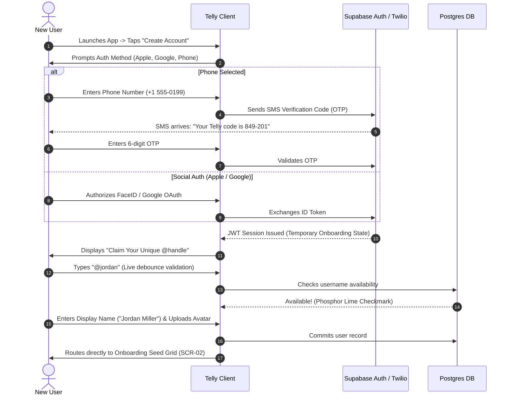

# Adjacent Systems Spec 01: Authentication, Registration & Login Flows

## 1. Overview & Security Philosophy
Authentication in **Telly** must balance **zero-friction viral onboarding** with **robust security, anti-bot protection, and account portability**. 

Since entertainment tracking is deeply personal and relies on a trusted friend graph, user handles must be clean, recognizable, and unique (e.g., `@jordan`), while login must take under 10 seconds across Apple, Google, and SMS/OTP.

---

## 2. Complete Registration & Sign-Up Flow



---

## 3. Screen Specifications & Wireframes

### Screen A1: Handle Reservation & Identity Setup
```
┌────────────────────────────────────────────────────────┐
│ [←]               STEP 1 OF 3                          │
│                                                        │
│  Claim your Telly handle                               │
│  This is how your friends will find and duel you.      │
│                                                        │
│  USERNAME                                              │
│  ┌──────────────────────────────────────────────────┐  │
│  │ @jordan                                      [✓] │  │
│  └──────────────────────────────────────────────────┘  │
│  ⚡ Nice! @jordan is available.                        │
│                                                        │
│  DISPLAY NAME                                          │
│  ┌──────────────────────────────────────────────────┐  │
│  │ Jordan Miller                                    │  │
│  └──────────────────────────────────────────────────┘  │
│                                                        │
│  PROFILE PHOTO (Optional)                              │
│         ┌──────────┐                                   │
│         │   (📷)   │  [ Upload from Photo Library ]    │
│         │  Avatar  │  [ Choose from TV Character Pack ]│
│         └──────────┘                                   │
│                                                        │
│  ┌──────────────────────────────────────────────────┐  │
│  │  CONTINUE TO HOUSEHOLD SETUP  →                  │  │
│  └──────────────────────────────────────────────────┘  │
└────────────────────────────────────────────────────────┘
```

#### Username Validation Rules:
- **Allowed Characters:** Alphanumeric lowercase (`a-z`, `0-9`) and single underscores (`_`).
- **Length:** 3 to 20 characters.
- **Reserved Handles:** System handles (`admin`, `telly`, `support`, `explore`, `official`), network names (`hbo`, `netflix`, `apple`), and offensive words automatically blocked via blacklist regex.
- **Live Debouncing:** Client debounces keystrokes at 200ms before querying `GET /api/v1/auth/check-username?u={handle}`.

---

### Screen A2: Login & Quick Recovery
```
┌────────────────────────────────────────────────────────┐
│ [✕ Cancel]            WELCOME BACK                     │
├────────────────────────────────────────────────────────┤
│                                                        │
│  Log in to your Telly account                          │
│                                                        │
│  ┌──────────────────────────────────────────────────┐  │
│  │   [] Continue with Apple                        │  │
│  └──────────────────────────────────────────────────┘  │
│  ┌──────────────────────────────────────────────────┐  │
│  │   [G] Continue with Google                       │  │
│  └──────────────────────────────────────────────────┘  │
│                                                        │
│  ─────────────── OR WITH PHONE / EMAIL ─────────────── │
│                                                        │
│  PHONE OR EMAIL                                        │
│  ┌──────────────────────────────────────────────────┐  │
│  │ jordan@example.com or +1 555-0199                │  │
│  └──────────────────────────────────────────────────┘  │
│                                                        │
│  ┌──────────────────────────────────────────────────┐  │
│  │  SEND SECURE LOGIN CODE  →                       │  │
│  └──────────────────────────────────────────────────┘  │
│                                                        │
│  [ 🔒 Unlock with Face ID / Biometrics ]               │
│                                                        │
│  Trouble logging in? [ Contact Support ]               │
└────────────────────────────────────────────────────────┘
```

---

## 4. Biometric Authentication & Session Security

### 4.1 Biometric Quick Unlock (FaceID / Fingerprint)
- Once authenticated, the JWT refresh token is encrypted inside the device's secure enclave (iOS `Keychain` with `kSecAccessControlBiometryAny`, Android `EncryptedSharedPreferences` backed by Hardware Keystore).
- If the app is closed for $> 7\text{ days}$, launching the app prompts an instant FaceID modal instead of forcing a full re-login.

### 4.2 Multi-Device & Session Management
- Users can be logged in across up to 5 concurrent devices (e.g., iPhone, iPad, Apple TV companion app, Android phone).
- Active sessions are viewable under **Settings $\rightarrow$ Account Security**, displaying:
  - Device Model (*"iPhone 15 Pro"*)
  - Approximate Location (*"New York, NY"*)
  - Last Active Timestamp (*"Active now"*)
  - Action: `[ Revoke Session ]`

---

## 5. Account Linking & Social Portability

Users can link multiple identity providers to a single Telly account:
- Primary Phone Number (used for SMS friend discovery and OTP recovery).
- Apple ID (used for 1-tap Sign-in with Apple).
- Google Account (used for Google OAuth).

### Conflict Resolution:
If a user signs in with Google using `jordan@gmail.com` and later attempts to link an Apple ID that uses `jordan@icloud.com`, Telly triggers a **Identity Consolidation Verification**:
- Sends a 6-digit confirmation code to the existing verified phone number.
- Upon verification, links both OAuth identities to the same `user_id` UUID.

---

## 6. Data Model: Auth & Sessions Schema

```sql
-- Extended User Auth Profile (Linked with Supabase auth.users)
CREATE TABLE user_auth_profiles (
    user_id UUID PRIMARY KEY REFERENCES auth.users(id) ON DELETE CASCADE,
    phone_number VARCHAR(20) UNIQUE,
    phone_verified BOOLEAN DEFAULT FALSE,
    apple_sub_id VARCHAR(255) UNIQUE,
    google_sub_id VARCHAR(255) UNIQUE,
    biometric_enabled BOOLEAN DEFAULT TRUE,
    created_at TIMESTAMP WITH TIME ZONE DEFAULT NOW(),
    last_login_at TIMESTAMP WITH TIME ZONE DEFAULT NOW()
);

-- Active User Sessions for Multi-Device Management
CREATE TABLE user_active_sessions (
    id UUID PRIMARY KEY DEFAULT gen_random_uuid(),
    user_id UUID REFERENCES auth.users(id) ON DELETE CASCADE,
    device_name VARCHAR(100) NOT NULL, -- e.g. 'iPhone 15 Pro'
    platform VARCHAR(20) NOT NULL,    -- 'iOS', 'Android', 'Web'
    ip_address INET,
    last_active TIMESTAMP WITH TIME ZONE DEFAULT NOW(),
    push_token TEXT,
    is_current_device BOOLEAN DEFAULT FALSE
);
```
