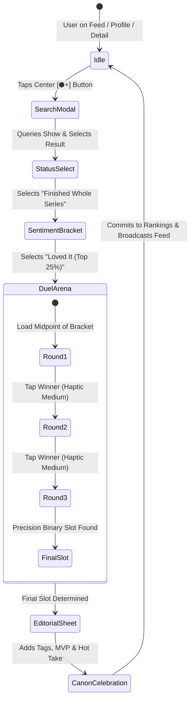
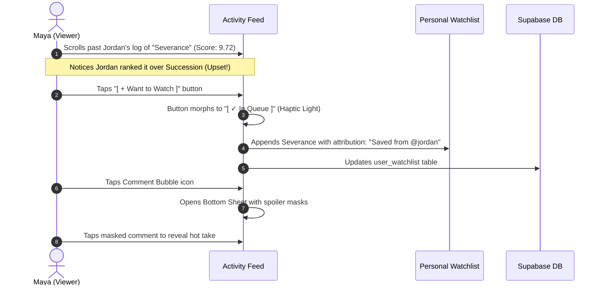
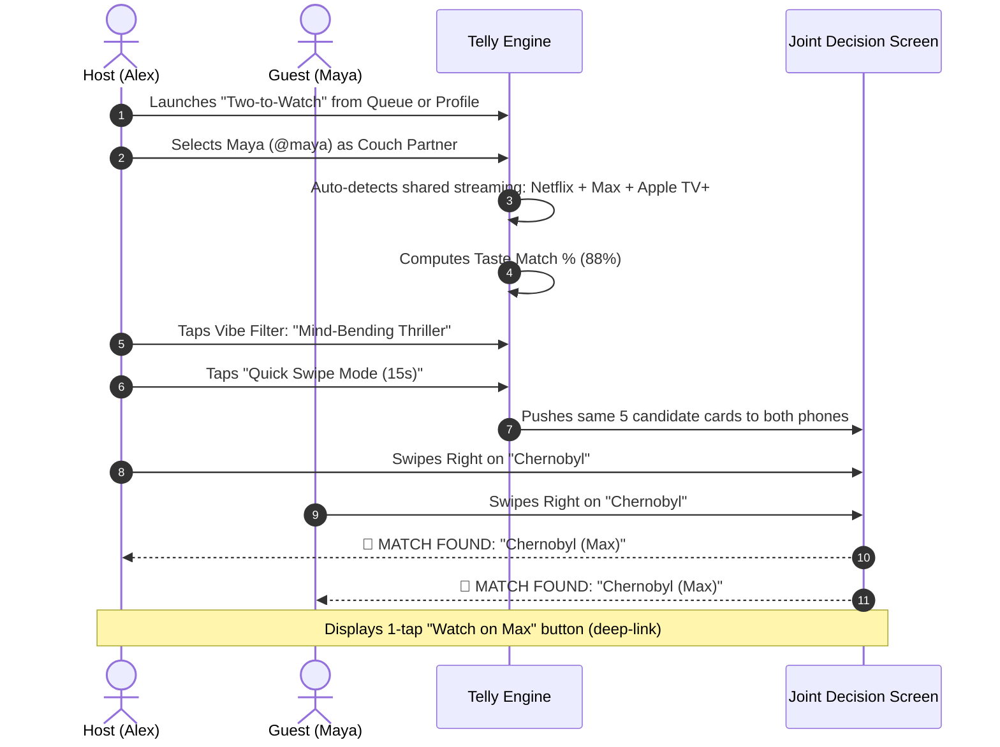

# Telly UI/UX Design System: 04 — User Interaction Flows, Gestures & State Machines

## 1. Master Gesture System & Physical Conventions

To make Telly feel fluid and premium like an Apple Design Award winner, gestures follow strict physical conventions across iOS and Android:

```
┌────────────────────────────────────────────────────────────────────────┐
│                        MASTER GESTURE CONVENTIONS                      │
├────────────────────────────────────────────────────────────────────────┤
│  GESTURE              TARGET COMPONENT       RESULTING ACTION          │
│  ────────────────────────────────────────────────────────────────────  │
│  Tap                  Show Card              Open Show Detail          │
│  Tap (Fast Double)    Feed Card              Quick Heart / Fire React  │
│  Long-Press (300ms)   Any Show Poster        Haptic Peek & Context Menu│
│  Swipe Right (List)   Queue Item             Mark as Seen / Log Show   │
│  Swipe Left (List)    Queue Item             Delete or Move to DNF     │
│  Swipe Up / Down      Duel Arena Card        Choose Winner             │
│  Drag & Drop (Hold)   Ranked Rankings Row       Re-order Rankings Slot       │
│  Pan Down             Modal Bottom Sheet     Dismiss / Close Sheet     │
│  Pull to Refresh      Top of Feed / Queue    Sync Data & Recalculate   │
└────────────────────────────────────────────────────────────────────────┘
```

---

## 2. End-to-End User Interaction Flows

### Flow 1: The Logging & Duel Tournament Flow (The Core Hook)



#### Step-by-Step Interaction Detail:
1. **Trigger:** User taps the floating lime `+ Log` button above the nav bar (component library §2.3; shown on Home, Explore, Rankings and Social), or the rank action on a title page (`SCR-08`).
2. **Instant Search (`SCR-09`):** Predictive search pulls from TMDB as user types (debounced at 150ms).
3. **Status Selection:** User selects `Finished Whole Series` (or `Up to Date`, `Season X`, `Dropped`).
4. **Sentiment Coarse Sort:** User taps one of 4 sentiment buckets (`Masterpiece`, `Loved`, `Liked`, `Meh`).
5. **The Duel Arena (`SCR-10`):**
   - The screen transitions into a dark, distraction-free arena.
   - Screen presents Show A vs. Show B.
   - User taps the superior show (card expands with glowing Phosphor Lime stroke, other card dismisses).
   - Repeats for 3 to 4 battles until the binary search tree terminates.
6. **Editorial Tagging (`SCR-11`):** User tags friends they watched with, selects MVP actor, and writes a 280-char micro-review.
7. **Rankings Reveal (`SCR-12`):** Card lands in the exact numerical slot on their canon with haptic vibration and score roll-up.

---

### Flow 2: Social Feed Discovery & 1-Tap Queue Ingestion



---

### Flow 3: "Two-to-Watch" Co-Watching Decider Flow



---

### Flow 4: Drag & Drop Rankings Re-Ordering Flow

```
User Holds Item for 300ms
           │
           ▼
[ Haptic Heavy Tick ] ── Item scales to 1.05x with shadow
           │
           ▼
[ User drags item up 3 slots ]
           │
           ▼
[ Haptic Light Tick on each row crossed ]
           │
           ▼
[ User Releases Finger ]
           │
           ▼
[ Item snaps smoothly into new slot ]
[ Real-time dynamic scores recalculate for all shifted shows ]
[ Persisted to Database in background transaction ]
```

---

### Flow 5: The TV Graveyard (DNF / Dropped) Flow

1. **Trigger:** User selects `Dropped / Stopped Watching` during logging or swipes left on a Queue item and chooses *"Move to Graveyard"*.
2. **Milestone Capture:** User selects:
   - Season: Picker wheel (e.g. `Season 3`).
   - Episode: Picker wheel (e.g. `Episode 4`).
3. **Taxonomy Reason Selector:** User taps one primary reason:
   - `Writing jumped the shark`
   - `Pacing slowed down / Boring`
   - `Favorite characters died or left`
   - `Too depressing / dark`
   - `Too many seasons / Time commitment`
4. **Willingness to Revisit Toggle:**
   - `🚪 Dead & Buried (Never revisiting)`
   - `🔄 Open to revisit if later seasons improve`
5. **Publish:** Broadcasts an optional "DNF Alert" to friends' feeds where friends can playfully vote: `[ Agree (14) ]` or `[ "It gets better!" (5) ]`.
