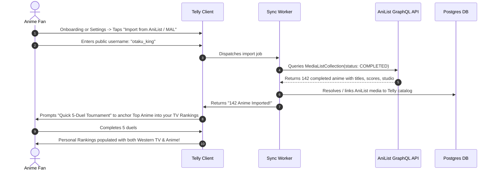

# Feature Spec 08: Anime Domain Integration, AniList Sync & Franchise Rollups

## 1. Executive Summary & The Hybrid Entertainment Thesis
While Western prestige television (HBO, Apple TV+, Netflix, FX) and Japanese Anime share the episodic serialized format, **Anime possesses distinct cultural, structural, and metadata characteristics** that generic tracking apps fail to accommodate:

1. **Fragmented Seasons & Cours:** Anime does not follow standard US TV season formats. A show might have *Season 1*, *Season 2 Cour 1*, *Season 2 Cour 2*, a canon bridging feature film (*Mugen Train*), and an OVA.
2. **Community Data Silos:** Over 85% of hardcore anime viewers already maintain their watch histories on **AniList** or **MyAnimeList (MAL)**. Forcing them to re-enter hundreds of shows manually is a fatal barrier to entry.
3. **Domain-Specific Attributes:** Viewers care intensely about **Animation Studios** (Ufotable, MAPPA, Kyoto Animation, Bones, Wit), **Source Material** (Manga, Light Novel, Original), and **Audio Format** (Sub vs Dub).
4. **Ranking Stability & Confidence:** When ranking 100+ shows, viewers need to know which rankings are statistically confident versus which were placed after just one or two duels.

**Telly's Hybrid Solution:**
A unified entertainment platform where prestige television (*Succession*, *The Bear*, *Severance*) and Anime (*Attack on Titan*, *Frieren*, *Jujutsu Kaisen*) live in one cohesive or filterable personal canon, powered by dual metadata engines (**TMDB + AniList GraphQL**).

---

## 2. Gap Analysis: Anime Proposal vs. Current Telly Architecture

| Feature in Anime Proposal | Captured in Telly Previously? | Telly Implementation & Enhancement |
| :--- | :---: | :--- |
| **AniList Profile / List Import** | ❌ Missing | **1-Click AniList & MAL Sync:** Ingest user's completed list directly during onboarding via public username. |
| **Franchise / Season Merging** | ⚠️ Partial | **"Franchise Rollup":** Toggle between ranking *Attack on Titan* as 1 master franchise vs. individual cours/seasons. |
| **TrueSkill Ranking Confidence ($\sigma$)** | ❌ Missing | **Ranking Confidence Indicators:** Visual halo indicating whether a show's position is *Locked (High Confidence)* or *Provisional (Needs Calibrating)*. |
| **Studio & Creator Tracking** | ⚠️ Western TV only | **Animation Studio Affinity:** Filter by MAPPA, Ufotable, Bones, KyoAni just like HBO or Apple TV+. |
| **AniList Recommendation Graph** | ❌ Missing | **Hybrid Recommendation Engine:** Blends AniList community recommendation edges with friend Taste Match %. |
| **Seasonal Anime Charts (Cours)** | ❌ Missing | **Seasonal Battlegrounds:** Real-time quarterly charts (Winter, Spring, Summer, Fall) for currently airing anime. |
| **Sub vs Dub Logging** | ❌ Missing | **Language & Audio Mode Tag:** Track whether watched in Japanese Sub or English Dub. |
| **Per-Show Duel Reset** | ❌ Missing | **"Re-Calibrate Show":** 1-tap reset of duel history for a specific anime to re-duel it with 3 fresh comparisons. |

---

## 3. AniList & MyAnimeList (MAL) 1-Click Profile Import



### GraphQL Query Schema (AniList Ingestion)
```graphql
query GetUserCompletedAnime($username: String) {
  MediaListCollection(userName: $username, type: ANIME, status: COMPLETED) {
    lists {
      name
      entries {
        score(format: POINT_10_DECIMAL)
        media {
          id
          idMal
          title {
            romaji
            english
            native
          }
          format
          episodes
          studios(isMain: true) {
            nodes {
              name
            }
          }
          coverImage {
            large
            extraLarge
          }
          bannerImage
          genres
          source
        }
      }
    }
  }
}
```

---

## 4. Franchise Rollup vs. Cour Unbundling

Anime franchises are notoriously fragmented. Telly introduces the **Franchise Rollup Engine**:

```
┌────────────────────────────────────────────────────────┐
│               FRANCHISE DISPLAY MODES                  │
├────────────────────────────────────────────────────────┤
│  MODE A: MASTER FRANCHISE ROLLUP (Default)             │
│  #03  ATTACK ON TITAN (All Seasons + Final Part) 9.68  │
│       Includes: S1, S2, S3 (P1/P2), Final Season       │
│                                                        │
│  MODE B: COUR / SEASON UNBUNDLED (Cinephile Mode)      │
│  #02  Attack on Titan: Season 3 Part 2 (Score: 9.85)   │
│  #14  Attack on Titan: Season 1        (Score: 9.12)   │
│  #42  Attack on Titan: The Final Season(Score: 8.64)   │
└────────────────────────────────────────────────────────┘
```

- **User Control:** Users can toggle on their profile:
  - `[✓] Roll up multi-season anime into single franchise entries`
- **Franchise Representative:** When rolled up, the franchise entry takes the **rank and score of the user's primary series ranking** (the parent franchise entry they dueled). Scores are never averaged across seasons. A dropdown shows the season-by-season grades.
- **Fallback:** If the user ranked only individual seasons (no primary series entry), the franchise entry takes the rank and score of their **highest-ranked season**.

---

## 5. Bayesian Ranking Confidence Indicators ($\mu$ & $\sigma$)

Inspired by TrueSkill, each ranking in Telly holds two internal values:
- **Skill Estimate ($\mu$):** The placement score ($1.0 - 10.0$).
- **Uncertainty ($\sigma$):** How confident the system is in this position ($0.0$ to $3.0$).

```
┌────────────────────────────────────────────────────────┐
│                 CANON CONFIDENCE STATES                │
├────────────────────────────────────────────────────────┤
│  #04  FRIEREN: BEYOND JOURNEY'S END            [ 9.62 ]│
│       🔒 LOCKED (High Confidence • 8 Duels Won)        │
│                                                        │
│  #18  SOLO LEVELING                            [ 8.84 ]│
│       ⚡ PROVISIONAL (±0.4 • 2 Duels • [ Calibrate ])  │
└────────────────────────────────────────────────────────┘
```

### Visual & Interactive Behavior:
- **Locked ($ \sigma < 0.5 $):** Solid border. The system has tested this title against multiple neighbors; its rank is mathematically stable.
- **Provisional ($ \sigma \ge 0.5 $):** Subtle dashed neon stroke with a pill: `[ ⚡ Calibrate ]`.
- **The "Calibrate" Tap:** Immediately launches 2 quick targeted pairwise duels against the shows ranked directly above and below it, reducing $\sigma$ and locking its position.

---

## 6. Anime-Specific UI Slicers & Metadata Tags

### 6.1 Studio Slicers (Discover & Profile)
Just as a user can view their "Top HBO Shows", they can view their **Top Studio Shows**:
- **Ufotable:** *Demon Slayer*, *Fate/Zero*, *Kara no Kyoukai*.
- **MAPPA:** *Jujutsu Kaisen*, *Chainsaw Man*, *Vinland Saga S2*, *Attack on Titan S4*.
- **Kyoto Animation:** *Violet Evergarden*, *A Silent Voice*, *Hyouka*.
- **Bones:** *Mob Psycho 100*, *Fullmetal Alchemist: Brotherhood*.
- **Madhouse:** *Frieren*, *Hunter x Hunter*, *Death Note*.

### 6.2 Source Material & Audio Format Tags
When logging an anime, the Editorial Sheet (`SCR-11`) dynamically shows:
- **Source Material:** `Manga Adaptation`, `Light Novel`, `Original Anime`, `Webtoon / Manhwa`.
- **Audio Mode:** `Japanese Audio (Sub)` | `English Dub`.
- **Filler Episodes Encountered:** Toggle: `[✓] Skipped Non-Canon Fillers`.

---

## 7. Seasonal Anime Charts (Cour Tracker)

In the **Discover Hub (`SCR-07`)**, a dedicated **"Seasonal Anime Battleground"** tracks currently airing anime:

```
┌────────────────────────────────────────────────────────┐
│  🌸 SPRING 2026 ANIME BATTLEGROUND                     │
│  Ranked by 380,000 Community Pairwise Duels:           │
├────────────────────────────────────────────────────────┤
│  1. Frieren: Beyond Journey's End (Season 2)    9.74   │
│     Studio: Madhouse • Ep 6/28 • Trending 🔥           │
│                                                        │
│  2. Chainsaw Man: Reze Arc                      9.52   │
│     Studio: MAPPA • Movie / Event                      │
│                                                        │
│  3. Oshi no Ko (Season 3)                       9.18   │
│     Studio: Doga Kobo • Ep 4/12                        │
│                                                        │
│  [ Rank Your Spring 2026 Tier List (Quick Duel) → ]    │
└────────────────────────────────────────────────────────┘
```

---

## 8. Database Schema Updates: Anime & Multi-Source Support

> **Schema note:** SQL in this document is illustrative. The normative contract is [Spec 02](../technical_architecture/02_DATABASE_SCHEMA_AND_STORED_PROCEDURES.md) (table `titles` keyed by `(id, media_type)`, `media_type_enum ('movie','tv')`, `rank_position`), and the executable source is `supabase/migrations/`.

```sql
-- Add AniList and MAL ID Mapping to titles
ALTER TABLE public.titles 
ADD COLUMN IF NOT EXISTS anilist_id INT UNIQUE,
ADD COLUMN IF NOT EXISTS mal_id INT,
ADD COLUMN IF NOT EXISTS anime_studio VARCHAR(100),
ADD COLUMN IF NOT EXISTS source_material VARCHAR(50), -- 'MANGA', 'LIGHT_NOVEL', 'ORIGINAL'
ADD COLUMN IF NOT EXISTS is_anime BOOLEAN DEFAULT FALSE;

-- Add Confidence & Franchise Rollup Settings to user_rankings
ALTER TABLE public.user_rankings
ADD COLUMN IF NOT EXISTS rating_uncertainty NUMERIC(3, 2) DEFAULT 1.20, -- sigma
ADD COLUMN IF NOT EXISTS audio_language VARCHAR(10) DEFAULT 'SUB',      -- 'SUB', 'DUB'
ADD COLUMN IF NOT EXISTS is_franchise_rollup BOOLEAN DEFAULT TRUE;

-- External Account Sync Table
CREATE TABLE public.user_external_anime_accounts (
    id UUID PRIMARY KEY DEFAULT gen_random_uuid(),
    user_id UUID REFERENCES public.users(id) ON DELETE CASCADE,
    service_name VARCHAR(20) NOT NULL, -- 'ANILIST', 'MYANIMELIST'
    external_username VARCHAR(100) NOT NULL,
    last_synced_at TIMESTAMP WITH TIME ZONE DEFAULT NOW(),
    imported_count INT DEFAULT 0,
    UNIQUE(user_id, service_name)
);
```
