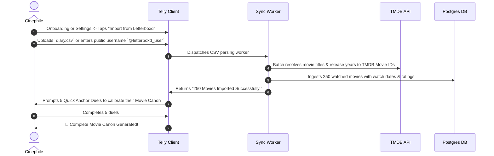

# Feature Spec 09: Movie Integration, Dual-Canon Architecture & Letterboxd Sync

## 1. Executive Summary & Value Proposition
By expanding **Telly** to treat **Movies** and **TV Shows & Anime** as two first-class citizens, Telly becomes the **universal, all-in-one screen entertainment platform**. 

Historically, viewers have been forced into unnatural platform fragmentation:
- **Letterboxd:** The dominant community for movie logging, but constrained by arbitrary 5-star ratings, severe score inflation (everything is 3.5 to 4.5 stars), no episodic TV support, no pairwise binary comparisons, and no co-watching decision tools.
- **TV Time / Trakt / AniList:** Utility-focused TV and anime calendars with minimal social virality or movie integration.

**The Telly Solution:**
A unified platform that elegantly houses **The Movie Canon** and **The Series & Anime Canon** under one roof. By segregating head-to-head duels by default (movies battle movies; series battle series), users avoid the cognitive fatigue of comparing a 90-minute film to an 86-hour epic, while enjoying a cohesive social feed, shared streaming intelligence, and joint co-watching tools.

---

## 2. The Dual-Canon Architecture

```
┌────────────────────────────────────────────────────────┐
│                      PROFILE HUB                       │
│                                                        │
│   ┌──────────────────────────┐┌──────────────────────┐ │
│   │   🎬 MOVIES (142)        ││  📺 TV & ANIME (94)  │ │
│   └──────────────────────────┘└──────────────────────┘ │
│                                                        │
│  [ Filter: All Decades ▾ ] [ Director ▾ ] [ Genre ▾ ]  │
│                                                        │
│  👑 GOD TIER                                           │
│  #01  INTERSTELLAR (2014) • Dir. Nolan          10.00  │
│  #02  PARASITE (2019) • Dir. Bong Joon-ho        9.82  │
│  #03  SPIRITED AWAY (2001) • Studio Ghibli       9.71  │
│                                                        │
│  ✨ PRESTIGE TIER                                      │
│  #04  DUNE: PART TWO (2024) • Dir. Villeneuve   9.45  │
│  #05  PULP FICTION (1994) • Dir. Tarantino       9.30  │
│                                                        │
│  [ ⚡ View Unified Master Canon (Movies + TV Blended) ]│
└────────────────────────────────────────────────────────┘
```

### 2.1 Why Segregated Canons Work
1. **Psychological Purity:** Evaluating *The Godfather* against *The Sopranos* head-to-head causes cognitive paralysis. A movie is evaluated on economy of storytelling, pacing, cinematography, and ending resolution over 120 minutes. A series is evaluated on multi-year character arcs and season pacing.
2. **Independent Leaderboards:**
   - **Movie Canon:** Ranks 1 to $N_{\text{movies}}$ with its own percentile score curve ($0.0 - 10.0$).
   - **Series Canon:** Ranks 1 to $N_{\text{series}}$ with its own percentile score curve ($0.0 - 10.0$).
3. **Unified Master Mode (Optional Toggle):**
   - For users who want a single master list of their favorite screen media, Telly computes a normalized composite ranking by interleaving items based on their calculated percentile scores.

---

## 3. The Movie Duel & Logging Experience

```
[ Tap "+" / Universal Search: "Oppenheimer" ]
                 │
                 ▼
[ Detect Media Type: MOVIE (TMDB ID 872585 • 180 min) ]
                 │
                 ▼
[ Step 1: Viewing Context & Rewatch ]
  • Venue: Watched in Theaters (IMAX 70mm) | Watched at Home
  • Viewing Type: First Time | Rewatch (Log #2)
                 │
                 ▼
[ Step 2: Sentiment Bracket (Movie Canon) ]
  • Masterpiece (Top 10%) | Loved It | Liked It | Meh | Regret
                 │
                 ▼
[ Step 3: Binary Duel Arena (Movies Only) ]
  • Round 1: Oppenheimer  VS  Interstellar
  • Round 2: Oppenheimer  VS  Dune: Part Two
  • Round 3: Oppenheimer  VS  There Will Be Blood
                 │
                 ▼
[ Step 4: Editorial Details ]
  • Director Tag: Christopher Nolan
  • Standout Performance: Cillian Murphy as J. Robert Oppenheimer
  • 280-char Review / Hot Take
                 │
                 ▼
[ Exact Slot Revealed: #04 of 142 Movies • Score: 9.68 ]
```

### 3.1 Movie-Specific Attributes Captured
- **Runtime:** Stored in minutes (e.g., `180 min`), powering instant co-watching duration filters.
- **Director & Cinematographer:** Automatically ingested from TMDB credits.
- **Viewing Venue:** `IMAX / Dolby Cinema`, `Standard Theater`, `Home Cinema / Couch`, `Airplane / Mobile`.
- **Rewatch Counter:** Increments user's total view count for that specific film.

---

## 4. 1-Click Letterboxd Profile & CSV Import

To eliminate cold-start friction for movie cinephiles, Telly provides direct Letterboxd synchronization:



---

## 5. "Two-to-Watch" (Co-Watching) Movie Night Mode

Adding movies elevates the "Two-to-Watch" decider from a TV-only tool into the ultimate living-room problem solver:

```
┌────────────────────────────────────────────────────────┐
│ [✕]                 TWO-TO-WATCH                       │
│  Couch: You & @maya (88% Taste Match)                  │
├────────────────────────────────────────────────────────┤
│                                                        │
│  WHAT ARE WE IN THE MOOD FOR?                          │
│  [  🎬 Movie Night (< 2h)  ]   [  📺 Start a Series  ] │
│                                                        │
│  TIME COMMITMENT:                                      │
│  ( ) Under 90 mins (Quick & Breezy)                    │
│  (•) 90 to 120 mins (Standard Feature)                 │
│  ( ) 2+ Hours (Epic Movie Night)                       │
│                                                        │
│  SHARED STREAMING SERVICES:                            │
│  [✓] Netflix   [✓] Max   [✓] Criterion   [✓] Prime     │
│                                                        │
│  GENRE VIBE:                                           │
│  [ Dark Comedy ]  [ Mind-Bending Sci-Fi ]  [ Thriller ]│
│                                                        │
│  ┌──────────────────────────────────────────────────┐  │
│  │     [ 🎲 FIND TONIGHT'S PERFECT MOVIE ]          │  │
│  └──────────────────────────────────────────────────┘  │
└────────────────────────────────────────────────────────┘
```

### Recommendation Scoring Algorithm for Movies:
$$\text{Score}(m) = w_1 \cdot \text{InBothWatchlists}(m) + w_2 \cdot \text{TasteMatch}(A, B) \cdot \text{MovieScore}(m) - w_3 \cdot |\text{Runtime}(m) - \text{TargetRuntime}|$$
- Filters out any movie not currently available on the users' shared streaming services.
- Surfaces high-probability hits in $< 5\text{ seconds}$.

---

## 6. Profile Cinema Analytics & Director Affinity

In the Profile Tab (`SCR-14`), tapping **Stats** on the Movie Canon displays dedicated cinema analytics:

```
┌────────────────────────────────────────────────────────┐
│                    CINEMA ANALYTICS                    │
├────────────────────────────────────────────────────────┤
│                                                        │
│  DIRECTOR AFFINITY (Top Average Scores)                │
│  1. Christopher Nolan       Avg: 9.62  (6 Films)       │
│  2. Denis Villeneuve        Avg: 9.48  (5 Films)       │
│  3. Hayao Miyazaki          Avg: 9.42  (7 Films)       │
│  4. Bong Joon-ho            Avg: 9.25  (4 Films)       │
│  5. Quentin Tarantino       Avg: 9.18  (8 Films)       │
│                                                        │
│  VIEWING VENUE BREAKDOWN                               │
│  • Theaters (IMAX / 35mm):  32%  [█████████           ]│
│  • Home Streaming:          68%  [██████████████████  ]│
│                                                        │
│  DECADE TIME TRAVEL                                    │
│  • 2020s: 38%  •  2010s: 34%  •  90s: 18%  • 70s: 10% │
│                                                        │
│  TOTAL RUNTIME: 284 Hours • 142 Movies Watched         │
└────────────────────────────────────────────────────────┘
```

---

## 7. Database Contracts: Unified Media Architecture

```sql
-- Create Media Type Enum
CREATE TYPE public.media_type_enum AS ENUM ('MOVIE', 'TV_SERIES');
CREATE TYPE public.viewing_venue_enum AS ENUM ('HOME', 'THEATER', 'IMAX', 'OTHER');

-- Alter tv_shows into unified media_items (or add polymorphic support)
ALTER TABLE public.tv_shows 
ADD COLUMN IF NOT EXISTS media_type media_type_enum DEFAULT 'TV_SERIES',
ADD COLUMN IF NOT EXISTS runtime_minutes INT,
ADD COLUMN IF NOT EXISTS director VARCHAR(100),
ADD COLUMN IF NOT EXISTS theatrical_release_date DATE;

-- Alter user_rankings to support dual canons
ALTER TABLE public.user_rankings
ADD COLUMN IF NOT EXISTS media_type media_type_enum DEFAULT 'TV_SERIES',
ADD COLUMN IF NOT EXISTS rank_order_medium INT, -- Rank within its medium (Movie #1 or TV #1)
ADD COLUMN IF NOT EXISTS is_rewatch BOOLEAN DEFAULT FALSE,
ADD COLUMN IF NOT EXISTS rewatch_count INT DEFAULT 1,
ADD COLUMN IF NOT EXISTS venue viewing_venue_enum DEFAULT 'HOME';

-- Indexing for Segregated Speed
CREATE INDEX idx_user_rankings_medium_rank ON public.user_rankings(user_id, media_type, rank_order_medium ASC);
CREATE INDEX idx_media_director ON public.tv_shows(director);
```
