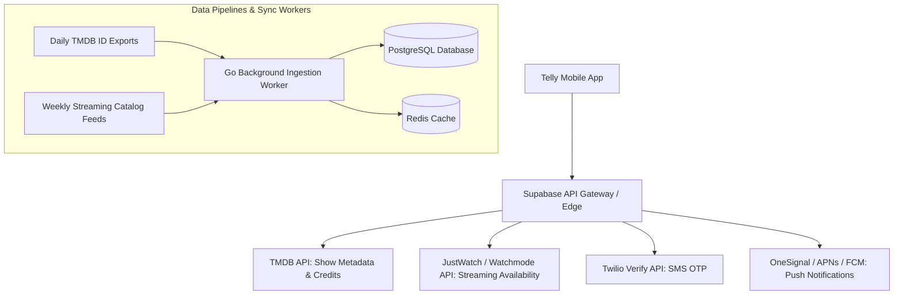

# Technical Architecture Spec 03: External APIs, Data Pipelines & Streaming Links

## 1. Overview & Data Flow Topology

Telly relies on external entertainment APIs to supply rich, verified metadata (posters, cast, seasons) and live streaming availability across global territories.



---

## 2. TMDB (The Movie Database) API Integration

### 2.1 API Configuration & Authentication
- **Base URL:** `https://api.themoviedb.org/3`
- **Auth:** Bearer Token via Header `Authorization: Bearer <TMDB_READ_ACCESS_TOKEN>`
- **Rate Limit Management:** 50 requests/second burst ceiling. Client requests query through our Cloudflare Workers edge cache to ensure TMDB quotas are never exceeded.

### 2.2 Primary Endpoints Used

| Endpoint | Purpose | Cache Policy (TTL) |
| :--- | :--- | :--- |
| `GET /search/multi?query={term}` | Multi-search returning both movies and TV series with `media_type` tags | 1 Hour (Cloudflare Edge) |
| `GET /movie/{id}?append_to_response=credits,keywords` | Full movie metadata, director, runtime, cast, release dates | 30 Days (Redis / Postgres) |
| `GET /tv/{id}?append_to_response=credits,keywords` | Full show metadata, showrunner, primary cast, network | 30 Days (Redis / Postgres) |
| `GET /tv/{id}/season/{num}` | Season episode list, episode titles, air dates | 14 Days (Postgres) |
| `GET /collection/{id}` | A film collection's parts and release dates (`belongs_to_collection` on the movie; features/10 §7, #140) | 7 Days (`title_collections`) |
| `GET /movie/changes` & `GET /tv/changes` | Daily delta feed of modified movie and TV metadata | Processed daily by cron |

### 2.3 Image CDN Optimization
TMDB delivers raw posters and stills. To maintain 60fps scrolling and avoid downloading 4MB images on mobile networks:
- **Poster Thumbnails (Feed / Canon):** `https://image.tmdb.org/t/p/w342{poster_path}` (Compressed WebP, ~28 KB)
- **Detail Posters & Share Cards:** `https://image.tmdb.org/t/p/w500{poster_path}` (~65 KB)
- **Cinematic 16:9 Backdrops:** `https://image.tmdb.org/t/p/w1280{backdrop_path}` (~180 KB)

---

## 3. JustWatch / Watchmode Streaming Availability Pipeline

### 3.1 Data Acquisition Strategy
Streaming rights expire and shift monthly. Rather than calling the third-party API on every user app tap, Telly uses a **Hybrid Edge Ingestion Pipeline**:
1. **Popular Shows (Top 5,000):** Synchronized daily via automated background Go worker.
2. **On-Demand Cache:** When an obscure show is opened, if its streaming entry in Redis is $> 7\text{ days}$ old, an asynchronous Edge Function queries Watchmode and refreshes the cache.

### 3.2 Deep-Link URL Generator Engine
To allow users to tap `[ ▶ Watch on Max ]` and jump directly into the native app on their iPhone or Android:

```dart
class StreamingDeepLinkFactory {
  static Uri generateDeepLink({
    required String providerId,
    required String countryCode,
    required String externalShowId,
    required String showSlug,
  }) {
    switch (providerId) {
      case 'netflix':
        // Opens Netflix app directly or falls back to web
        return Uri.parse('nflx://www.netflix.com/title/$externalShowId');
        
      case 'max':
        return Uri.parse('https://play.max.com/show/$externalShowId');
        
      case 'apple_tv_plus':
        return Uri.parse('https://tv.apple.com/$countryCode/show/$showSlug/$externalShowId');
        
      case 'hulu':
        return Uri.parse('hulu://series/$externalShowId');
        
      case 'prime_video':
        return Uri.parse('primevideo://watch?asin=$externalShowId');
        
      case 'disney_plus':
        return Uri.parse('https://www.disneyplus.com/series/$showSlug/$externalShowId');

      case 'crunchyroll':
        return Uri.parse('crunchyroll://series/$externalShowId');
        
      default:
        return Uri.parse('https://www.google.com/search?q=watch+$showSlug+online');
    }
  }
}
```

---

## 4. Letterboxd & AniList Data Ingestion Pipelines

### 4.1 Letterboxd Ingestion Architecture (`diary.csv` & User Profiles)
- **Supported Formats:**
  1. Standard Letterboxd export ZIP / `diary.csv` (`Date, Name, Year, Letterboxd URI, Rating, Rewatch, Tags, Watched Date`).
  2. Public username crawl (public diary & ratings RSS feed).
- **Matching Pipeline:**
  1. Title + Release Year queried against TMDB `/search/movie?query={Name}&year={Year}`.
  2. Rating Conversion (Coarse Seed Placement):
     - 5.0 Stars $\implies$ Initial bracket: *Masterpiece (Top 10%)*
     - 4.0–4.5 Stars $\implies$ Initial bracket: *Loved It (Top 25%)*
     - 3.0–3.5 Stars $\implies$ Initial bracket: *Liked It (Middle 40%)*
     - 2.0–2.5 Stars $\implies$ Initial bracket: *Meh (Bottom 20%)*
     - 0.5–1.5 Stars $\implies$ Initial bracket: *Disappointed (Bottom 5%)*
  3. Rewatch detection: Sets `is_rewatch = true` and calculates rewatch frequency.
  4. Stores external link in `user_external_accounts (service_name: 'LETTERBOXD')`.

### 4.2 AniList & MyAnimeList Ingestion Architecture
- **AniList GraphQL Client:** Fetches user's `MediaListCollection` with status `COMPLETED`.
- **MyAnimeList REST API v2:** Queries `/users/{username}/animelist?status=completed&fields=list_status`.
- **Franchise Rollup Logic:** Condenses multi-cour or separate seasonal IDs into a parent franchise node with selectable sub-seasons.

---

## 5. Push Notification Engine (APNs & FCM)

Delivered via **OneSignal** / **Firebase Cloud Messaging** with localized payloads and custom deep-link routing tags:

### 5.1 Payload Example: The Upset Alert
```json
{
  "to": "device_push_token_user_123",
  "notification": {
    "title": "🚨 Spicy Upset from Jordan!",
    "body": "Jordan just ranked Severance over Succession. See where it landed in their God Tier.",
    "sound": "telly_haptic_chime.aiff"
  },
  "data": {
    "type": "UPSET_NOTIFICATION",
    "ranking_id": "8c6b755b-f1f3-42bf-9051-f2fbe4fbc112",
    "user_handle": "jordan",
    "click_action": "FLUTTER_NOTIFICATION_CLICK",
    "route": "/feed/post/8c6b755b-f1f3-42bf-9051-f2fbe4fbc112"
  }
}
```

### 5.2 Payload Example: "Leaving Soon" Warning
```json
{
  "notification": {
    "title": "⚠️ Watchlist Alert: Leaving Hulu in 7 Days",
    "body": "Fargo (Seasons 1–4) is leaving your Hulu subscription on Oct 31."
  },
  "data": {
    "type": "LEAVING_SOON",
    "tmdb_id": 60622,
    "route": "/show/60622"
  }
}
```

---

## 6. Twilio Verify API (SMS Authentication)

- **Verification Service:** Twilio Verify v2 (reduces SMS toll-fraud).
- **Format:** Strict E.164 phone normalization (`+14155552671`).
- **Fraud Guard:** Rate-limited to max 3 verification requests per IP/Device per 15 minutes.
