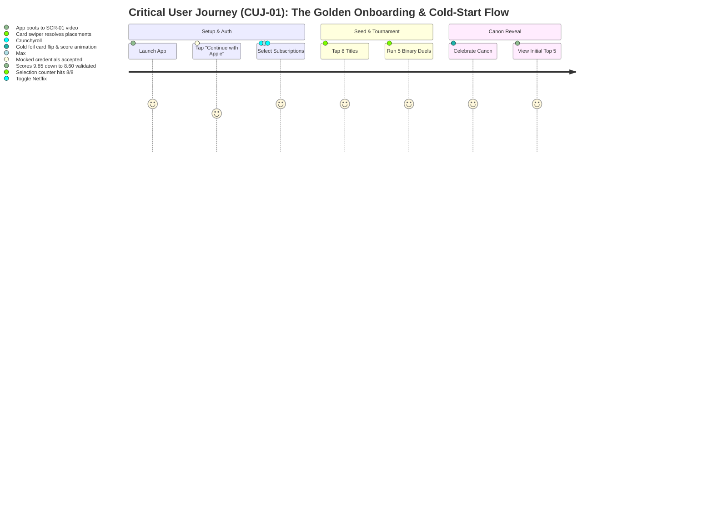
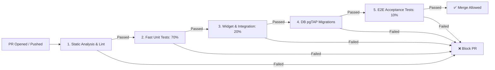

# Technical Architecture Spec 06: Testing Framework & Test Pyramid

## 1. Quality Strategy & The Telly Test Pyramid

To achieve 99.9% crash-free sessions, mathematical sorting integrity, and 60fps gesture fluidness across iOS and Android, **Telly** enforces a strict, automated **Test Pyramid** testing strategy.

Rather than relying on brittle, slow, and expensive manual QA or top-heavy end-to-end testing, the quality engineering strategy allocates automated tests according to the classical test pyramid distribution:

```
               ▲
              / \
             /   \         Top: E2E Tests (~10%)
            / E2E \        • Critical User Journeys (CUJs)
           /───────\       • Device Hardware & Offline Sync
          /         \      • package:integration_test / Maestro
         /  WIDGET   \
        / INTEGRATION \    Middle: Integration & Widget Tests (~20%)
       /───────────────\   • Flutter Widget Component Tests (WidgetTester)
      /                 \  • Riverpod State Machines & Controllers
     /       UNIT        \ • Supabase pgTAP Stored Procedures & RLS
    /     TESTS (70%)     \• External API Contract Mocks (WireMock)
   /───────────────────────\
   Bottom: Unit Tests (70%)
   • Pure Algorithms: Binary Search, Spearman Rank, TrueSkill, Dynamic Curve
   • Data Models, Immutability & Serialization (fromJson / toJson)
   • Local Drift SQLite ORM & Write-Ahead Log (WAL)
   • Letterboxd CSV & AniList GraphQL Ingestion Parsers
```

### 1.1 Test Pyramid Metrics & SLA Matrix

| Test Layer | Volume Share | Max Execution Time (Local) | Max CI Run Time | Target Code Coverage | Primary Tooling |
| :--- | :---: | :---: | :---: | :---: | :--- |
| **Layer 1: Unit Tests** | **70%** | $< 15\text{ seconds}$ | $< 60\text{ seconds}$ | **$\ge 90\%$** on core algorithms<br>**$\ge 80\%$** on repos & models | `package:test`, `mockito`, `build_runner` |
| **Layer 2: Integration & Widget** | **20%** | $< 45\text{ seconds}$ | $< 3\text{ minutes}$ | **$\ge 75\%$** on widgets<br>**$100\%$** on stored procs | `package:flutter_test`, `pgTAP`, Riverpod container |
| **Layer 3: End-to-End (E2E)** | **10%** | $< 3\text{ minutes}$ | $< 10\text{ minutes}$ | **$100\%$** on Critical User Journeys | `package:integration_test`, Firebase Test Lab |
| **Supplementary: Golden & a11y** | Continuous | $< 30\text{ seconds}$ | $< 2\text{ minutes}$ | Core Screens & Design Tokens | `matchesGoldenFile`, `SemanticsTester` |

---

## 2. Layer 1: Unit Testing Specifications (Base — 70%)

Unit tests run in pure Dart VM without booting the Flutter rendering engine or connecting to external network resources. They are deterministic, sub-millisecond, and execute on every git pre-commit hook.

### 2.1 Pure Algorithms & Mathematical Invariants
Every mathematical algorithm in Telly must pass exhaustive unit tests under extreme edge cases, boundary conditions, and stress datasets:

1. **Binary Insertion Sort Tournament Engine (`lib/features/ranking/domain/`)**:
   - **Search Space Reduction**: Verify that candidate sub-arrays shrink by $\approx 50\%$ on each duel decision.
   - **Logarithmic Bound ($\mathcal{O}(\log_2 N)$)**: Assert that inserting into a list of 100 titles never prompts more than 7 duels (and $\le 4$ duels when seeded with a sentiment bracket).
   - **Deadlock Handling**: Verify that selecting *"Can't Compare / Equal"* steps to $\pm 1$ neighbor and terminates without infinite loops or corrupted indices.
   - **First/Second Item Invariants**: Zero duels for $N=0$; exactly 1 duel for $N=1$.

2. **Dynamic Percentile Score Formula**:
   - Verify: $\text{Score}(1) = 10.00$ for all $N \ge 1$.
   - Verify: $\text{Score}(N) = 1.00$ for all $N > 1$.
   - Assert monotonic strictly decreasing order: $\forall i < j \implies \text{Score}(i) \ge \text{Score}(j)$.
   - Validate Bayesian prior blending for low-sample profiles ($N < 10$).

3. **Spearman Rank Correlation ($\rho$) & Taste Match %**:
   - **Identical Canons**: $R_A = R_B \implies \rho = 1.00 \implies \text{Taste Match} = 100\%$.
   - **Reversed Canons**: $R_A = \text{reverse}(R_B) \implies \rho = -1.00 \implies \text{Taste Match} = 0\%$.
   - **Bayesian Confidence Shrinkage**: Verify that mutual overlap $k=2$ with identical order yields $\le 65\%$ match rather than $100\%$ due to shrinkage prior $k_0 = 5$.
   - **Dual-Canon Isolation**: Assert that movie duels do not impact series correlation and vice versa.

4. **TrueSkill Uncertainty ($\sigma$) & State Transitions**:
   - Verify initial state: $\sigma = 1.20 \implies \text{status: Provisional}$.
   - Verify decay step: $\sigma_{\text{next}} = \max(0.15, \sigma_{\text{curr}} \times 0.75)$.
   - Verify locking threshold: When $\sigma < 0.50 \implies \text{status: Locked}$.

5. **Squad Consensus Borda Count**:
   - Assert mathematically fair rank aggregation when group members have missing overlapping titles.

### 2.2 Ingestion & Parsing Engines
1. **Letterboxd `diary.csv` Ingestion**:
   - Parse CSV headers (`Date, Name, Year, Letterboxd URI, Rating, Rewatch, Tags, Watched Date`).
   - Validate star rating to sentiment bucket mapping ($5.0 \star \implies \text{Top 10%}$, $0.5 \star \implies \text{Bottom 5%}$).
   - Parse boolean rewatch flags and rewatch frequency counters.
   - Resiliency: Handle missing years, Unicode title escapes, malformed commas, and truncated files without exceptions.
2. **AniList GraphQL Response Deserializer**:
   - Verify transformation from `MediaListCollection` to internal `MediaItem` models.
   - Test Franchise Rollup aggregator combining cours into franchise parent entities.

### 2.3 Local Database & Offline Write-Ahead Log (WAL)
1. **Drift SQLite Data Access Objects (DAOs)**:
   - Test in-memory Drift database (`NativeDatabase.memory()`).
   - Test CRUD operations on `CachedShows`, `LocalRankings`, `OfflineDuelQueue`.
   - Test FIFO transaction queue flushing upon simulated network recovery.

---

## 3. Layer 2: Integration & Widget Testing Specifications (Middle — 20%)

Integration tests verify that individual components interact properly with state management, animated widgets, and the persistence layer.

### 3.1 Flutter Widget Tests (`package:flutter_test`)
Widget tests verify rendering, user interaction, animation frames, and accessibility labels using `WidgetTester`:

1. **The Binary Duel Arena (`SCR-10`)**:
   - **Initial Render**: Verify Candidate A and Candidate B posters, titles, year/runtime, and the central `VS` badge are mounted.
   - **Tap Selection**: Tap Candidate A card $\implies$ verify scale-up animation initiates, `HapticFeedback` is invoked, and Candidate B fades downward.
   - **Swipe Gesture**: Drag card upward $\ge 300\text{ px}$ $\implies$ verifies swipe-up registers as Candidate A win.
   - **Can't Compare Action**: Tap *"🤷 Can't Compare"* $\implies$ verifies adjacent replacement card mounts within 300ms.
   - **Memory & Leak Safety**: Assert zero uncancelled timers or animation ticker leaks upon modal dismiss.

2. **Seed Recognition Grid (`SCR-03`)**:
   - **Multi-Select Toggle**: Tap 3 cards $\implies$ verify 3 checkmark badges display.
   - **Counter Badge Logic**: Floating button remains disabled (`Select at least 8 titles`) until 8th item is tapped; upon 8th item, verifies button becomes active Phosphor Lime.
   - **Media Filter Pills**: Tap `[ 🎬 Movies ]` $\implies$ verify non-movie tiles are filtered out from the rendered sliver list.

3. **Logging Details Modal (`SCR-11`)**:
   - **Contextual Fields**:
     - When logging a Movie: Assert `Viewing Venue` (Theatrical/IMAX, Home) and `Rewatch Stepper` are visible.
     - When logging a Series: Assert `Binge Velocity` chips are visible and venue is hidden.
   - **Character Limit Guard**: Input 300 characters in review box $\implies$ assert text is capped at exactly 280 characters with counter indicating `(280/280)`.

4. **Dual-Canon Profile View (`SCR-14`)**:
   - **Tab Switching**: Tap `[ 🎬 Movie Canon ]` $\implies$ displays movie ranking rows. Tap `[ 📺 Series & Anime ]` $\implies$ switches list without full page reload.
   - **Tier Accordion**: Tap `👑 GOD TIER` header $\implies$ animates accordion collapse/expansion.

### 3.2 State Management & Riverpod Integration Tests
- Instantiate an isolated `ProviderContainer` with mocked network overrides.
- Test `DuelController`:
  - `startTournament(mediaItem, sentimentBucket)`
  - `recordDuelOutcome(winnerId, loserId)`
  - Assert that `state` advances through `DuelState.inProgress` to `DuelState.completed` with exact target rank index.

### 3.3 Database Stored Procedures & RLS Security Tests (`pgTAP`)
Executed against an isolated local Supabase PostgreSQL container via `supabase test db`:

> **Schema note:** SQL in this document is illustrative. The normative contract is [Spec 02](02_DATABASE_SCHEMA_AND_STORED_PROCEDURES.md) (table `titles` keyed by `(id, media_type)`, `media_type_enum ('movie','tv')`, `rank_position`), and the executable source is `supabase/migrations/`.

```sql
-- pgTAP Test Suite: tests/database/01_atomic_ranking_test.sql
BEGIN;
SELECT plan(6);

-- 1. Test user creation
INSERT INTO public.users (id, username, display_name) 
VALUES ('00000000-0000-0000-0000-000000000001', 'test_critic', 'Test Critic');

-- 2. Test initial show ranking insertion
SELECT lives_ok(
    $$ SELECT insert_user_ranking_atomic(
        '00000000-0000-0000-0000-000000000001'::uuid, 157336, 1, 
        'COMPLETED'::watch_status_enum, 'STILL_AIRING'::finale_impact_enum, 
        'Masterpiece', ARRAY['#PeakSciFi'], 'Cooper', 'movie'::media_type_enum, false, 'THEATRICAL_IMAX'::viewing_venue_enum
    ) $$,
    'First movie ranking inserted successfully'
);

-- 3. Assert dynamic score for #1 is exactly 10.00
SELECT results_eq(
    $$ SELECT calculated_score FROM public.user_rankings 
       WHERE user_id = '00000000-0000-0000-0000-000000000001'::uuid AND show_id = 157336 $$,
    $$ VALUES (10.00::numeric) $$,
    'First item must receive score 10.00'
);

-- 4. Test second movie insertion and atomic rank shifting
SELECT lives_ok(
    $$ SELECT insert_user_ranking_atomic(
        '00000000-0000-0000-0000-000000000001'::uuid, 496243, 1, 
        'COMPLETED'::watch_status_enum, 'STILL_AIRING'::finale_impact_enum, 
        'Genre peak', ARRAY['#Thriller'], 'Ki-taek', 'movie'::media_type_enum, false, 'HOME'::viewing_venue_enum
    ) $$,
    'Second movie inserted at rank 1'
);

-- 5. Assert previous #1 was shifted to rank 2
SELECT results_eq(
    $$ SELECT rank_position FROM public.user_rankings 
       WHERE user_id = '00000000-0000-0000-0000-000000000001'::uuid AND show_id = 157336 $$,
    $$ VALUES (2) $$,
    'Previous rank 1 must shift to rank 2'
);

-- 6. Verify Row Level Security: User cannot update another user's rankings
SET ROLE authenticated;
SET request.jwt.claim.sub = '00000000-0000-0000-0000-000000000002';
SELECT throws_ok(
    $$ UPDATE public.user_rankings SET rank_position = 99 WHERE user_id = '00000000-0000-0000-0000-000000000001'::uuid $$,
    'RLS must block foreign user updates'
);

SELECT * FROM finish();
ROLLBACK;
```

---

## 4. Layer 3: End-to-End (E2E) Acceptance Testing (Top — 10%)

End-to-End tests run compiled release/profile binaries on physical hardware or headless emulators (`Android API 34` / `iOS Simulator 17.5`) via `package:integration_test`. They validate that the entire system works cohesively from UI gestures to network calls and disk persistence.

### 4.1 Critical User Journeys (CUJs) Under Test



#### CUJ-01: Cold-Start Onboarding to Canon Celebration
- **Test Objective**: Verify a first-time user can install the app, authenticate, select subscriptions, pick 8 seed titles, finish a 5-duel tournament, and arrive at their calibrated Top 5 leaderboard.
- **Validation Points**:
  - Auth token persisted in secure enclave.
  - Streaming services saved in Drift SQLite and synced to Supabase.
  - Exactly 5 duel records recorded in `pairwise_duels`.
  - Profile displays #1 title with gold border and dynamic score.

#### CUJ-02: Complete Movie Logging & Slot Insertion
- **Test Objective**: Verify logging a new film (*Dune: Part Two*) into an existing 25-movie canon.
- **Workflow**:
  1. Open search modal (`SCR-09`) $\rightarrow$ type `"Dune Part Two"`.
  2. Select TMDB result $\rightarrow$ select *"Masterpiece (Top 10%)"*.
  3. Complete 4 head-to-head duels in the Duel Arena (`SCR-10`).
  4. Tag venue (*"Theatrical / IMAX"*) and add 120-char review in `SCR-11`.
  5. Tap *"Publish to Canon"*.
- **Validation Points**:
  - Confirms slot reveal animation in `SCR-12`.
  - Verifies *Dune: Part Two* appears at expected rank (e.g. #3) on `SCR-14`.
  - Verifies all subsequent movies shifted ranks and had scores recalculated.
  - Verifies new activity post appears on the home feed (`SCR-05`).

#### CUJ-03: "Two-to-Watch" Co-Watching Decider with "Movie Night"
- **Test Objective**: Verify two connected users resolve couch paralysis.
- **Workflow**:
  1. Navigate to Explore $\rightarrow$ launch "Two-to-Watch" (`SCR-16`).
  2. Add Friend `@maya` $\rightarrow$ assert Taste Match badge displays `88%`.
  3. Select Format: `[ 🎬 Movie Night ]` $\rightarrow$ select runtime `< 90 min (Breezy)`.
  4. Tap *"Find What to Watch"* $\rightarrow$ assert candidate list returns only movies under 90 minutes available on shared Netflix/Max subscriptions.
  5. Launch 15-second swipe duel $\rightarrow$ swipe right on mutual title $\rightarrow$ assert match dialog.

#### CUJ-04: Airplane Mode Offline Logging & Sync Resilience
- **Test Objective**: Validate zero data loss during connectivity dropouts.
- **Workflow**:
  1. Simulate device entering airplane mode (`NetworkService.disconnect()`).
  2. Log a TV show and complete duels.
  3. Assert UI updates instantaneously (0ms optimistic latency) from local Drift SQLite.
  4. Re-enable network (`NetworkService.reconnect()`).
  5. Assert background worker flushes queued transactions to Supabase and receives confirmed server timestamps.

#### CUJ-05: Medals, Challenges & Levels (features/10; #149)
- **Test Objective**: The gamification loop works from a ranking to what the person sees, and only rankings placed through duels count (features/10 §2).
- **Where**: `integration_test/helpers/gamification_journeys.dart`, run on the emulator by `cuj_05_gamification_test.dart` and on the host by `test/integration/gamification_journeys_test.dart`. Rankings go through the real `RankingRepository`, offline queue and `SyncEngine`; a fake server applies the rules that pgTAP 021–030 verify against Postgres.
- **Workflow**:
  1. Rank a tenth film through duels → after sync the unlock moment shows Ticket Stub → Pin to profile → Done → the medal shows on the More profile card.
  2. Join Spooktober from Challenges → rank two films → after sync its medal's unlock moment shows → pull to refresh Social → the challenge feed card shows.
  3. Import a film (no duels), then rank one through duels → Your level shows 10 XP: the import earned nothing.

---

## 5. Supplementary Testing & Verification Layers

### 5.1 Visual Golden Regression Testing
To guarantee pixel-perfect adherence to the *Midnight Cathode & Phosphor Neon* design system:
- Capture goldens of all primary components across light/dark variations and form factors (iPhone 15 Pro, Pixel 8, iPad Mini).
- Threshold: Any pixel discrepancy $> 0.5\%$ fails the build.
- Key Targets:
  - Duel Arena VS Badge glow.
  - Feed Upset card with Neon Coral badge (`#FF5C5C`).
  - Frosted glass navigation bar with blur sigma 20.

### 5.2 Accessibility (a11y) Audits
- **Target**: WCAG 2.1 AA Compliance.
- **Semantics Inspection**: Every interactive icon button (e.g. `[ + ]`, `[ ✕ ]`, `[ 💬 ]`) must have non-empty `semanticLabel`.
- **Minimum Tap Targets**: All clickable elements must enforce $\ge 48 \times 48\text{ dp}$ touch bounding boxes.
- **Contrast Ratio Verification**: Text contrast against `#0A0B10` background must exceed $4.5:1$ (tested automatically via `flutter_test` accessibility guidelines).

### 5.3 Frame-Rate & Memory Leak Profiling
- **Frame Budget**: 60fps ($16.6\text{ ms/frame}$) and 120fps ($8.33\text{ ms/frame}$ on ProMotion displays).
- Automated test runs `test_driver/perf_driver.dart` executing a 500-item scroll through the Canon and 20 card swipes:
  - Fails CI if `missed_frame_build_budget_count > 0`.
  - Fails CI if memory footprint grows unbounded after 50 consecutive duels (detecting image texture retention).

---

## 6. Concrete Implementation Code & Test Templates

### 6.1 Unit Test Template: Pairwise Binary Search Engine

```dart
// test/unit/ranking/pairwise_engine_test.dart
import 'package:flutter_test/flutter_test.dart';
import 'package:telly/features/ranking/domain/pairwise_tournament.dart';
import 'package:telly/features/ranking/domain/media_ranking.dart';

void main() {
  group('PairwiseTournament Engine', () {
    late List<MediaRanking> existingCanon;

    setUp(() {
      // Seed existing canon of 10 items (Ranks 1 to 10)
      existingCanon = List.generate(
        10,
        (i) => MediaRanking(
          showId: 1000 + i,
          title: 'Existing Show #$i',
          rankOrder: i + 1,
          calculatedScore: 10.0 - (i * 0.9),
          mediaType: 'movie',
        ),
      );
    });

    test('calculates optimal binary midpoint for unseeded tournament', () {
      final tournament = PairwiseTournament(
        newCandidateId: 9999,
        existingCanon: existingCanon,
        lowBound: 0,
        highBound: 9,
      );

      // Midpoint of 0..9 is index 4 (Rank #5)
      expect(tournament.currentOpponentIndex, equals(4));
      expect(tournament.currentOpponent.rankOrder, equals(5));
    });

    test('narrows search range upwards when candidate wins duel', () {
      final tournament = PairwiseTournament(
        newCandidateId: 9999,
        existingCanon: existingCanon,
        lowBound: 0,
        highBound: 9,
      );

      // User votes Candidate > Show at index 4
      tournament.recordDecision(Decision.candidateWins);

      // High bound should now be mid - 1 = 3 (Search space: 0..3)
      expect(tournament.highBound, equals(3));
      expect(tournament.lowBound, equals(0));
      expect(tournament.currentOpponentIndex, equals(1)); // Midpoint of 0..3 is 1
    });

    test('terminates at exact rank slot in logarithmic steps', () {
      final tournament = PairwiseTournament(
        newCandidateId: 9999,
        existingCanon: existingCanon,
        lowBound: 0,
        highBound: 9,
      );

      int duelCount = 0;
      while (!tournament.isComplete) {
        duelCount++;
        // Simulate candidate being better than rank 4, but worse than rank 2
        if (tournament.currentOpponent.rankOrder > 3) {
          tournament.recordDecision(Decision.candidateWins);
        } else {
          tournament.recordDecision(Decision.opponentWins);
        }
      }

      // 10 items requires at most ceil(log2(10)) = 4 comparisons
      expect(duelCount, lessThanOrEqualTo(4));
      expect(tournament.resolvedTargetRank, equals(4));
    });

    test('handles deadlock without corruption when user cannot compare', () {
      final tournament = PairwiseTournament(
        newCandidateId: 9999,
        existingCanon: existingCanon,
        lowBound: 0,
        highBound: 9,
      );

      // User taps "Can't Compare"
      tournament.recordDecision(Decision.cannotCompare);

      expect(tournament.hasAttemptedNeighborFallback, isTrue);
      expect(tournament.isComplete, isFalse);
    });
  });
}
```

### 6.2 Unit Test Template: Spearman Taste Match Correlation

```dart
// test/unit/social/taste_match_calculator_test.dart
import 'package:flutter_test/flutter_test.dart';
import 'package:telly/features/social/domain/taste_match_calculator.dart';

void main() {
  group('TasteMatchCalculator', () {
    test('returns 100% match for identical rankings with sufficient sample', () {
      final userARanks = {'show_1': 1, 'show_2': 2, 'show_3': 3, 'show_4': 4, 'show_5': 5, 'show_6': 6};
      final userBRanks = {'show_1': 1, 'show_2': 2, 'show_3': 3, 'show_4': 4, 'show_5': 5, 'show_6': 6};

      final result = TasteMatchCalculator.compute(userARanks: userARanks, userBRanks: userBRanks);

      expect(result.rawCorrelation, closeTo(1.00, 0.001));
      expect(result.mutualCount, equals(6));
      expect(result.displayPercentage, equals(100));
    });

    test('applies Bayesian shrinkage penalty to low mutual overlaps', () {
      // Only 2 mutual shows (both ordered #1 and #2)
      final userARanks = {'show_1': 1, 'show_2': 2};
      final userBRanks = {'show_1': 1, 'show_2': 2};

      final result = TasteMatchCalculator.compute(userARanks: userARanks, userBRanks: userBRanks);

      // Raw rho is 1.0, but shrinkage W(2) = 2 / (2 + 5) = 2/7 ≈ 0.285
      // Adjusted rho ≈ 0.285 * 1.0 = 0.285 -> Percentage ≈ ((0.285 + 1)/2)*100 ≈ 64%
      expect(result.rawCorrelation, equals(1.00));
      expect(result.displayPercentage, equals(64));
    });

    test('returns 0% for diametrically opposed rankings with high sample size', () {
      final userARanks = {'s1': 1, 's2': 2, 's3': 3, 's4': 4, 's5': 5, 's6': 6, 's7': 7, 's8': 8};
      final userBRanks = {'s1': 8, 's2': 7, 's3': 6, 's4': 5, 's5': 4, 's6': 3, 's7': 2, 's8': 1};

      final result = TasteMatchCalculator.compute(userARanks: userARanks, userBRanks: userBRanks);

      expect(result.rawCorrelation, closeTo(-1.00, 0.001));
      expect(result.displayPercentage, equals(0));
    });
  });
}
```

### 6.3 Widget Test Template: Duel Arena Interaction

```dart
// test/widget/ranking/duel_arena_widget_test.dart
import 'package:flutter/material.dart';
import 'package:flutter_test/flutter_test.dart';
import 'package:flutter_riverpod/flutter_riverpod.dart';
import 'package:telly/features/ranking/presentation/duel_arena_screen.dart';
import 'package:telly/features/ranking/presentation/duel_card_widget.dart';

void main() {
  testWidgets('Duel Arena renders both cards and registers tap winner', (WidgetTester tester) async {
    bool duelVoted = false;
    int? winningId;

    await tester.pumpWidget(
      ProviderScope(
        child: MaterialApp(
          home: Scaffold(
            body: DuelArenaView(
              candidateATitle: 'Severance',
              candidateBTitle: 'Succession',
              candidateAId: 110492,
              candidateBId: 76331,
              duelNumber: 2,
              totalDuels: 4,
              onSelectWinner: (winnerId) {
                duelVoted = true;
                winningId = winnerId;
              },
            ),
          ),
        ),
      ),
    );

    // Verify initial render
    expect(find.text('Severance'), findsOneWidget);
    expect(find.text('Succession'), findsOneWidget);
    expect(find.text('DUEL 2 OF 4'), findsOneWidget);
    expect(find.text('━ VS ━'), findsOneWidget);

    // Locate Card A and tap it
    final cardAFinder = find.widgetWithText(DuelCard, 'Severance');
    await tester.tap(cardAFinder);
    await tester.pumpAndSettle();

    // Verify callback
    expect(duelVoted, isTrue);
    expect(winningId, equals(110492));
  });
}
```

---

## 7. CI/CD Quality Gates & Automated Enforcement

All pull requests into `main` must pass an automated GitHub Actions pipeline executing the test pyramid stages sequentially:



### 7.1 Pull Request Blocking Rules
1. **Zero Lint & Analyzer Errors**: `dart analyze --fatal-infos` must return zero issues.
2. **Code Coverage Ceiling**:
   - `lib/features/ranking/domain/` (Pairwise algorithms, math): **Must not drop below 90%**.
   - Overall project: **Must not drop below 80%**.
3. **No Flaky Tests**: Tests must pass with `--test-randomize-ordering-seed=random`.
4. **pgTAP Database Schema Parity**: All migrations must pass cleanly on a blank Supabase container with zero schema drift.
5. **No Missed Frame Regressions**: Frame timing budget must meet the $< 16.6\text{ ms}$ ceiling.

### 7.2 Which Jobs Run (#122)
`.github/workflows/ci.yml` first detects which areas a push or PR touched, and runs only the jobs for those areas. A skipped job counts as passing.

| Job | Runs when these change |
| :--- | :--- |
| Flutter lint, tests & coverage | `lib/`, `test/`, `integration_test/`, Dart files under `tool/`, `assets/`, `pubspec.*`, `analysis_options.yaml`, `dart_test.yaml` |
| Android emulator E2E (CUJ-01 to CUJ-05) | `lib/`, `integration_test/`, `android/`, `assets/`, `pubspec.*`, `test/fakes/`, `test/helpers/`, `test/features/**/*_fixtures.dart` |
| pgTAP, RLS & concurrency | `supabase/migrations/`, `supabase/tests/`, `supabase/seed.sql`, `supabase/config.toml` |
| Edge functions (Deno) | `supabase/functions/` |
| Agent instructions in sync | `AGENTS.md`, `CLAUDE.md`, `GEMINI.md`, `.agents/`, `.claude/`, `tool/agents/`, `tool/tracker/*.json` |

A push that only touches other files (for example `docs/`) runs just the change check. Editing `ci.yml` itself, or a manual **Run workflow**, runs every job. A newer push to the same branch cancels the older run. When a new job or folder is added, extend its filter in the `changes` job.

---
*Document Version: 1.0.0*  
*Author: Antigravity Quality & Systems Engineering Team*
